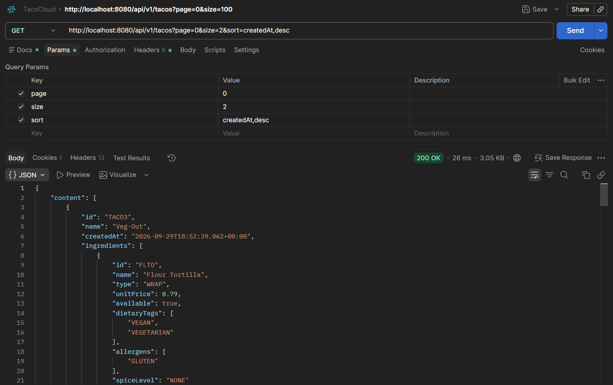
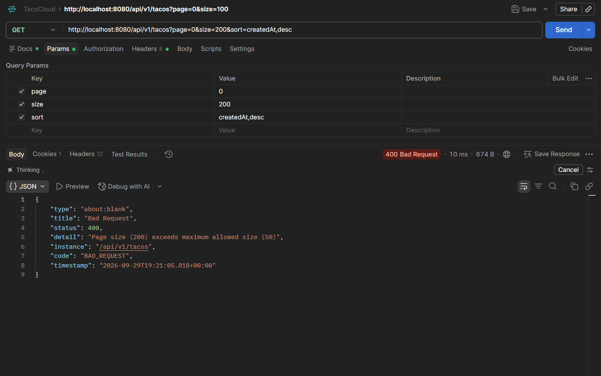
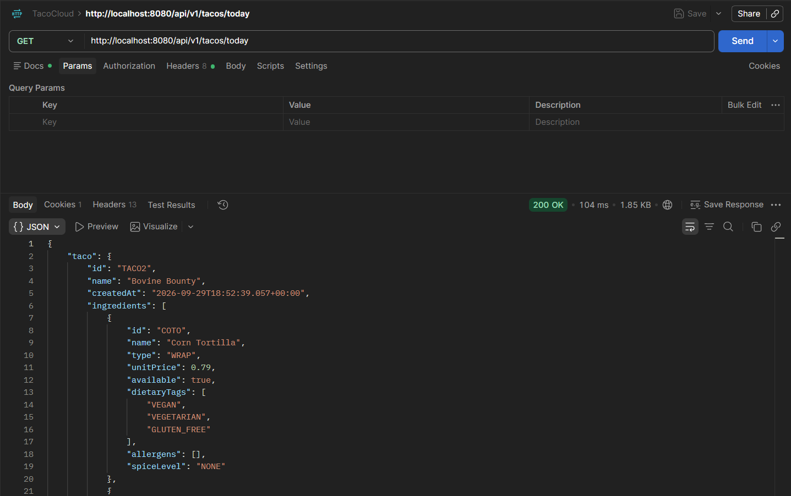
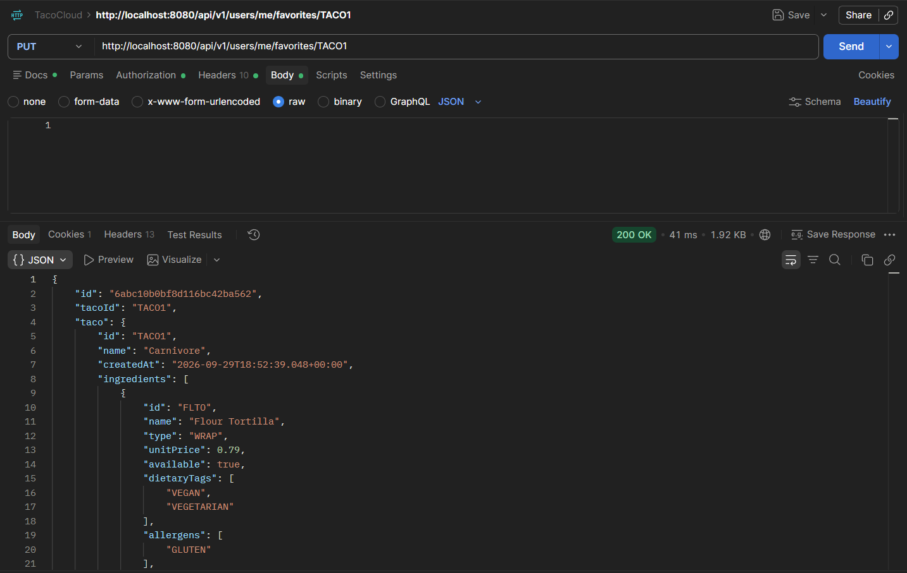
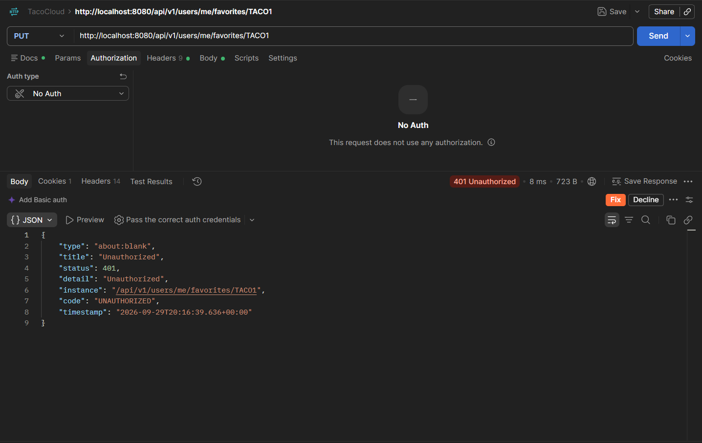
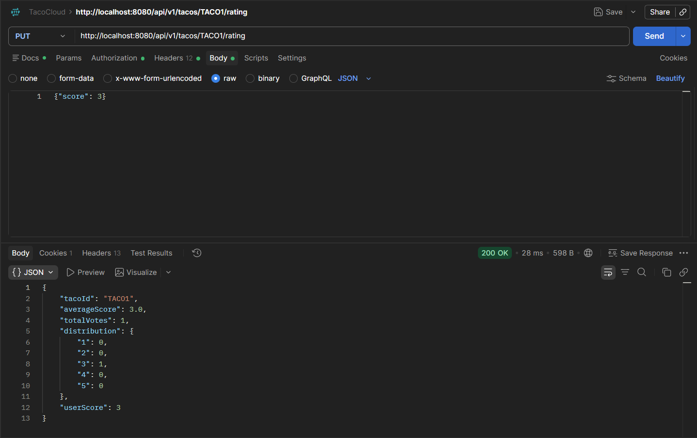
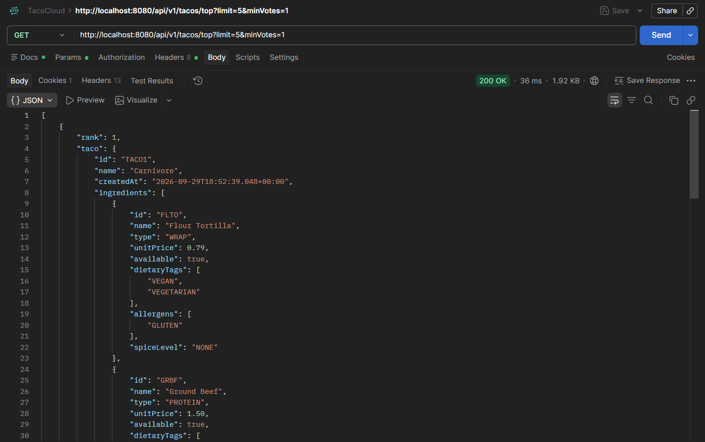
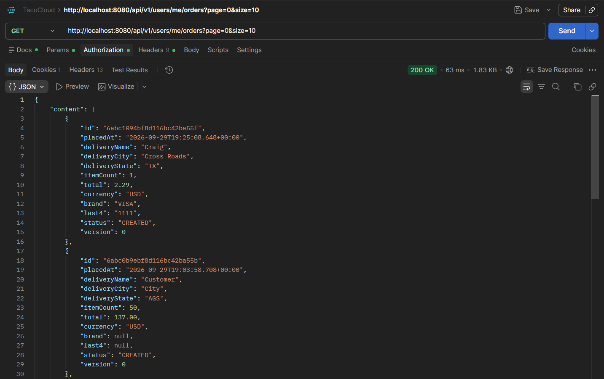
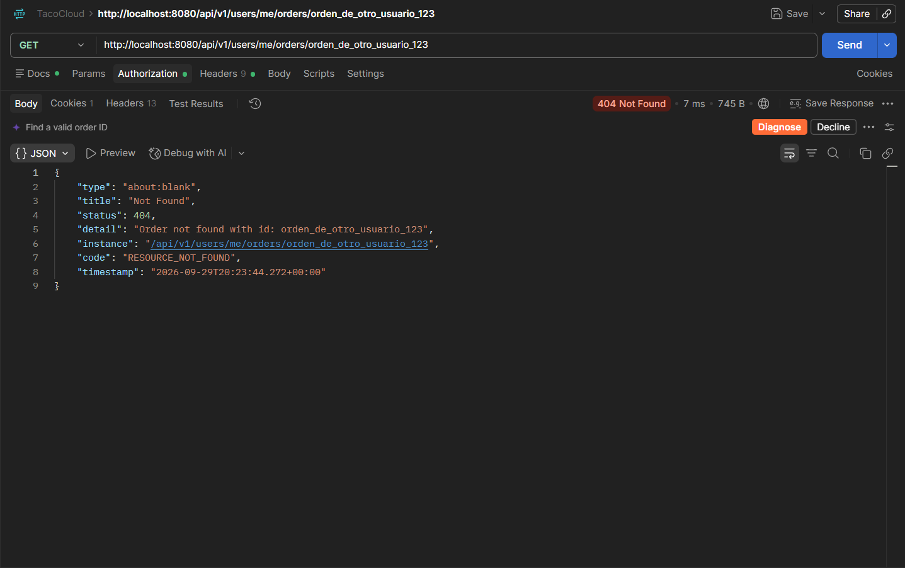
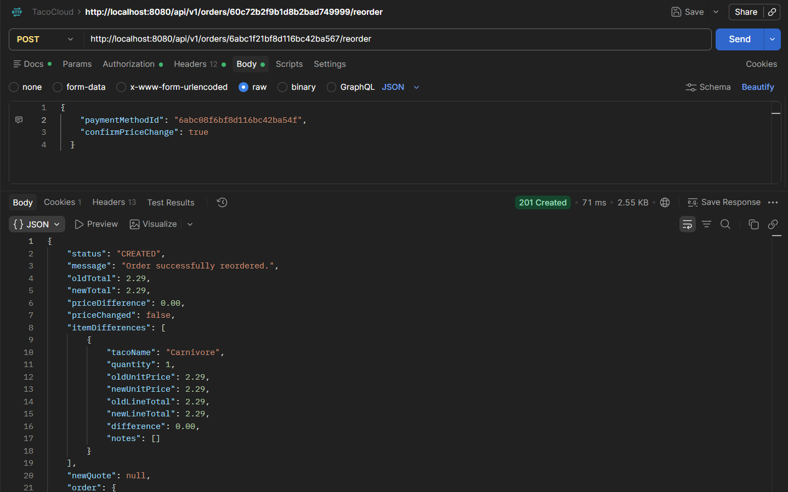

[← Laboratorio 3: Motor de negocio](laboratorio-3-motor-de-negocio.md) | [Índice General](README.md) | [Laboratorio 5: Cocina y mensajería confiable →](laboratorio-5-cocina-y-mensajeria-confiable.md)

---

# Laboratorio 4: Funciones que sí dan ganas de usar

## Resumen Ejecutivo del Laboratorio

El **Laboratorio 4** se centra en la experiencia de usuario, el descubrimiento de productos y la gestión personalizada de la interacción cliente-plataforma. En arquitecturas reactivas modernas, no basta con exponer operaciones CRUD básicas: es imprescindible proporcionar capacidades avanzadas de búsqueda multicriterio con paginación acotada, recomendaciones diarias deterministas libres de efectos colaterales, gestión segura de listas de favoritos inmunes a vulnerabilidades de autorización (IDOR), sistemas justos de calificación con agregación analítica, visibilidad privada del historial de compras y flujos de recompra inteligentes capaces de conciliar discrepancias de precios e inventario en tiempo real.

A lo largo de los retos funcionales **TC-19** al **TC-24**, Taco Cloud consolida una capa de API orientada al consumidor bajo estrictos principios de diseño REST, inmutabilidad de datos históricos, seguridad contextual basada en `SecurityContext` y concurrencia optimista reactiva con Project Reactor y Spring Data Reactive MongoDB.


---

## Reto Funcional TC-19: Buscar, filtrar, ordenar y paginar tacos

### 1. Objetivo del Reto y Resultado Funcional
* **Objetivo:** Proveer un mecanismo integral de búsqueda, filtrado dinámico multicriterio (por nombre, ingrediente específico, etiqueta dietética, exclusión de alérgenos y nivel de picante), ordenación configurable y paginación acotada para el catálogo de tacos. Adicionalmente, resolver el desacople en la interfaz gráfica legacy donde el frontend realizaba peticiones a `/tacos?recent` en lugar de la ruta estandarizada `/api/v1/tacos`.
* **Resultado Funcional:** La API expone un endpoint unificado `GET /api/v1/tacos` que procesa criterios de búsqueda combinados de forma reactiva, valida límites de página (`maxPageSize=50`), previene inyecciones o desbordamientos de memoria en base de datos, y retorna metadatos completos de paginación (`page`, `size`, `totalElements`, `totalPages`) en un contenedor `TacoPage<TacoResponse>`.

### 2. Archivos Objetivo y Código Base
* [`TacoController.java`](../tacocloud-api/src/main/java/tacos/web/api/TacoController.java): Endpoint principal con `@GetMapping` soportando query params opcionales y mapping de respuestas enriquecidas.
* [`TacoSearchCriteria.java`](../tacocloud-api/src/main/java/tacos/search/TacoSearchCriteria.java): Value Object que encapsula los filtros de búsqueda, ordenación y paginación.
* [`TacoPage.java`](../tacocloud-api/src/main/java/tacos/search/TacoPage.java): DTO genérico de respuesta para colecciones paginadas con cálculo de páginas totales.
* [`TacoRepository.java`](../tacocloud-data-mongodb/src/main/java/tacos/data/TacoRepository.java): Interfaz reactiva con método de extensión `searchTacos(TacoSearchCriteria criteria)`.
* [`TacoRepositoryImpl.java`](../tacocloud-data-mongodb/src/main/java/tacos/data/TacoRepositoryImpl.java): Implementación dinámica con `ReactiveMongoTemplate` construyendo objetos `Criteria` y `Query`.

### 3. Cambios Realizados y Arquitectura

#### Comparativa de Implementación:

```java
// CÓDIGO ORIGINAL:
// TacoController exponía únicamente listado total sin paginar ni filtrar,
// y existía un mapeo residual dependiente del parámetro "recent".
@GetMapping(params="recent")
public Flux<Taco> recentTacos() {
  return tacoRepo.findAll().take(12);
}
```

```java
// CÓDIGO IMPLEMENTADO:
// Búsqueda multicriterio reactiva, validación de rangos de paginación y normalización REST v1.
@GetMapping
public Mono<TacoPage<TacoResponse>> searchTacos(
    @RequestParam(name = "name", required = false) String name,
    @RequestParam(name = "ingredientId", required = false) String ingredientId,
    @RequestParam(name = "diet", required = false) DietaryTag diet,
    @RequestParam(name = "excludeAllergen", required = false) Allergen excludeAllergen,
    @RequestParam(name = "spice", required = false) SpiceLevel spice,
    @RequestParam(name = "page", defaultValue = "0") int page,
    @RequestParam(name = "size", defaultValue = "20") int size,
    @RequestParam(name = "sort", defaultValue = "createdAt,desc") String sort) {

  if (page < 0) {
    return Mono.error(new ResponseStatusException(HttpStatus.BAD_REQUEST, "Page index must not be less than zero"));
  }
  if (size < 1) {
    return Mono.error(new ResponseStatusException(HttpStatus.BAD_REQUEST, "Page size must be greater than zero"));
  }
  if (size > maxPageSize) {
    return Mono.error(new ResponseStatusException(HttpStatus.BAD_REQUEST,
        String.format("Page size (%d) exceeds maximum allowed size (%d)", size, maxPageSize)));
  }

  TacoSearchCriteria criteria = TacoSearchCriteria.builder()
      .name(name)
      .ingredientId(ingredientId)
      .diet(diet)
      .excludeAllergen(excludeAllergen)
      .spice(spice)
      .page(page)
      .size(size)
      .sort(sort)
      .build();

  return tacoRepo.searchTacos(criteria)
      .map(tacoPage -> tacoPage.map(this::toTacoResponse))
      .onErrorMap(IllegalArgumentException.class,
          ex -> new ResponseStatusException(HttpStatus.BAD_REQUEST, ex.getMessage()));
}
```

### 4. Contratos y Especificación HTTP

* **Método:** `GET`
* **Ruta:** `/api/v1/tacos` (alias retrocompatible `/api/tacos`)
* **Parámetros de Consulta (Query Params):**
  * `name` *(string, opcional)*: Subcadena insensible a mayúsculas/minúsculas para el nombre del taco.
  * `ingredientId` *(string, opcional)*: Identificador de ingrediente requerido (ej. `FLTO`, `GRBF`).
  * `diet` *(enum, opcional)*: Etiqueta dietética (`VEGAN`, `VEGETARIAN`, `NON_VEGETARIAN`).
  * `excludeAllergen` *(enum, opcional)*: Alérgeno a excluir (`DAIRY`, `GLUTEN`, etc.).
  * `spice` *(enum, opcional)*: Nivel de picante (`MILD`, `MEDIUM`, `HOT`, `EXTRA_HOT`).
  * `page` *(int, opcional, default: `0`)*: Índice de página base 0.
  * `size` *(int, opcional, default: `20`, máx: `50`)*: Cantidad de elementos por página.
  * `sort` *(string, opcional, default: `createdAt,desc`)*: Campo y dirección de ordenación.
* **Encabezados:** `Accept: application/json`
* **Cuerpo de Solicitud:** N/A
* **Cuerpo de Respuesta (200 OK):**
```json
{
  "content": [
    {
      "id": "60c72b2f9b1d8b2bad743321",
      "name": "Carnitas Fiesta",
      "createdAt": "2026-09-28T12:00:00.000Z",
      "dietaryTag": "NON_VEGETARIAN",
      "spiceLevel": "MEDIUM",
      "allergens": ["DAIRY"],
      "ingredients": [
        { "id": "FLTO", "name": "Flour Tortilla", "type": "WRAP" },
        { "id": "CARN", "name": "Carnitas", "type": "PROTEIN" }
      ]
    }
  ],
  "page": 0,
  "size": 20,
  "totalElements": 1,
  "totalPages": 1
}
```
* **Códigos de Estado:**
  * `200 OK`: Consulta ejecutada con éxito (incluso si `content` es una lista vacía).
  * `400 BAD REQUEST`: Parámetros de paginación inválidos (`page < 0`, `size < 1` o `size > 50`) o formato de ordenamiento erróneo.

### 5. Guía de Pruebas en Postman

#### Configuración de la Solicitud
* **Method:** `GET`
* **URL:** `http://localhost:8080/api/v1/tacos?diet=NON_VEGETARIAN&excludeAllergen=GLUTEN&page=0&size=10&sort=createdAt,desc`
* **Headers:**
  * `Accept: application/json`
* **Body:** None

#### Comando cURL - Caso de Éxito (Filtrado y Paginación)
```bash
curl -X GET "http://localhost:8080/api/v1/tacos?page=0&size=2&sort=createdAt,desc" \
  -H "Accept: application/json"
```

#### Comando cURL - Caso de Error (Paginación Excedida > 50)
```bash
curl -X GET "http://localhost:8080/api/v1/tacos?page=0&size=200&sort=createdAt,desc" \
  -H "Accept: application/json"
```

### 6. Espacio para Evidencias





### 7. Pregunta Oficial para Defender la Solución

**Pregunta para Defender la Solución**: *¿Offset paging es suficiente o un cursor sería más estable cuando se insertan tacos nuevos?*

**Defensa Técnica**:
> **El paginado por cursor (keyset pagination) es técnicamente más estable y eficiente para colecciones con alta frecuencia de inserción, pero el offset paging acotado es la solución adecuada para el catálogo de Taco Cloud**.
>
> 1. **Problema del Offset Paging (*Page Drift* y costo $O(N)$):** El paginado por desplazamiento tradicional (`skip(page * size)`) sufre de corrimiento de elementos cuando ocurren inserciones o eliminaciones concurrentes durante la navegación del usuario (provocando elementos repetidos u omitidos entre páginas consecutivas). Además, el motor de base de datos debe escanear y descartar $N$ documentos en memoria antes de retornar el lote solicitado.
> 2. **Ventajas del Cursor-Based Paging:** Al anclar la consulta a un puntero inmutable indexado (ej. `WHERE (createdAt, id) < (cursorCreatedAt, cursorId) LIMIT size`), el acceso es estrictamente $O(1)$, inmune a inserciones intermedias y óptimo para scroll infinito.
> 3. **Justificación en Taco Cloud:** Los clientes requieren navegación multidireccional con salto directo a páginas arbitrarias (ej. saltar a la página 5) y filtros dinámicos combinados. Dado que el catálogo de tacos tiene una cardinalidad moderada, el **offset paging protegido por un límite estricto (`maxPageSize=50`)** y validación de enteros negativos proporciona la ergonomía REST necesaria sin degradar la memoria ni la estabilidad del clúster MongoDB.

### 8. Criterios de Aceptación
- [x] Filtros por `name`, `ingredientId`, `diet`, `excludeAllergen` y `spice` combinables dinámicamente.
- [x] Parámetros de paginación validados: rechaza `page < 0`, `size < 1` y `size > 50` con `400 BAD REQUEST`.
- [x] Retorno consistente en estructura `TacoPage` con cálculo exacto de `totalElements` y `totalPages`.
- [x] Redirección/soporte para corregir la llamada del frontend legacy hacia `/api/v1/tacos`.

---

## Reto Funcional TC-20: Taco del día determinista y comprobable

### 1. Objetivo del Reto y Resultado Funcional
* **Objetivo:** Exponer un endpoint que recomiende el "Taco del Día" de manera completamente determinista y reproducible, basado en una fecha calendario, zona horaria explícita (`America/Mexico_City`) y un reloj inyectable (`Clock`), garantizando que la recomendación solo seleccione tacos que cumplan las reglas físicas de diseño y cuyos ingredientes se encuentren actualmente en stock.
* **Resultado Funcional:** Cualquier consulta a `GET /api/v1/tacos/today` efectuada durante la misma fecha calendario en la zona horaria establecida retornará exactamente el mismo taco y razón de selección, eliminando el uso de números aleatorios no controlados (`Math.random()`) y permitiendo pruebas unitarias con simulación de tiempo.

### 2. Archivos Objetivo y Código Base
* [`TacoOfTheDayService.java`](../tacocloud-api/src/main/java/tacos/recommendation/TacoOfTheDayService.java): Servicio con lógica de cálculo determinista, inyección de `Clock`, `ZoneId` y caché diaria atómica con invalidación por rotura de stock.
* [`TacoController.java`](../tacocloud-api/src/main/java/tacos/web/api/TacoController.java): Exposición del endpoint `GET /api/v1/tacos/today`.
* [`TacoOfTheDayResponse.java`](../tacocloud-api/src/main/java/tacos/web/api/dto/TacoOfTheDayResponse.java): DTO de respuesta con el taco enriquecido, la fecha evaluada y el motivo generado.

### 3. Cambios Realizados y Arquitectura

#### Comparativa de Implementación:

```java
// CÓDIGO ORIGINAL:
// Inexistente o implementado con selección aleatoria no reproducible:
public Taco getTacoOfTheDayRandom() {
  List<Taco> all = tacoRepo.findAll().collectList().block();
  return all.get(new Random().nextInt(all.size())); // No determinista, inmune a pruebas automatizadas
}
```

```java
// CÓDIGO IMPLEMENTADO:
// Algoritmo modular determinista sobre candidatos filtrados por stock y física, inyectando Clock y ZoneId.
public Mono<TacoOfTheDayResponse> getTacoOfTheDay() {
  LocalDate today = LocalDate.now(clock.withZone(zoneId));

  CachedDailyTaco cached = cache.get();
  if (cached != null && cached.date.equals(today)) {
    return isTacoStillAvailable(cached.taco)
        .flatMap(isAvailable -> {
          if (Boolean.TRUE.equals(isAvailable)) {
            return Mono.just(cached.response);
          }
          cache.set(null); // Invalidar si los ingredientes salieron de stock
          return computeTacoOfTheDay(today);
        });
  }

  return computeTacoOfTheDay(today);
}

private Mono<TacoOfTheDayResponse> computeTacoOfTheDay(LocalDate today) {
  return tacoRepo.findAll()
      .filterWhen(this::isCandidateValidAndAvailable)
      .collectList()
      .flatMap(candidates -> {
        if (candidates.isEmpty()) {
          cache.set(null);
          return Mono.empty();
        }

        // Ordenamiento canónico estable por ID para garantizar reproducibilidad
        candidates.sort(Comparator.comparing(Taco::getId, Comparator.nullsLast(String::compareTo)));

        // Índice cíclico determinista a partir de los días transcurridos de la época
        long epochDay = today.toEpochDay();
        int index = (int) Math.floorMod(epochDay, candidates.size());
        Taco selectedTaco = candidates.get(index);

        String reason = generateReason(today, selectedTaco);
        TacoResponse tacoResponse = toTacoResponse(selectedTaco);

        TacoOfTheDayResponse response = TacoOfTheDayResponse.builder()
            .taco(tacoResponse)
            .date(today)
            .reason(reason)
            .build();

        cache.set(new CachedDailyTaco(today, selectedTaco, response));
        return Mono.just(response);
      });
}
```

### 4. Contratos y Especificación HTTP

* **Método:** `GET`
* **Ruta:** `/api/v1/tacos/today`
* **Encabezados:** `Accept: application/json`
* **Cuerpo de Solicitud:** N/A
* **Cuerpo de Respuesta (200 OK):**
```json
{
  "date": "2026-09-29",
  "reason": "Recomendación especial para el martes: balance perfecto de Carnitas Fiesta",
  "taco": {
    "id": "60c72b2f9b1d8b2bad743321",
    "name": "Carnitas Fiesta",
    "createdAt": "2026-09-28T12:00:00.000Z",
    "dietaryTag": "NON_VEGETARIAN",
    "spiceLevel": "MEDIUM",
    "allergens": ["DAIRY"],
    "ingredients": [
      { "id": "FLTO", "name": "Flour Tortilla", "type": "WRAP" },
      { "id": "CARN", "name": "Carnitas", "type": "PROTEIN" }
    ]
  }
}
```
* **Códigos de Estado:**
  * `200 OK`: Taco del día resuelto exitosamente.
  * `404 NOT FOUND`: No existen tacos disponibles que cumplan las validaciones físicas y de inventario en el catálogo.

### 5. Guía de Pruebas en Postman

#### Configuración de la Solicitud
* **Method:** `GET`
* **URL:** `http://localhost:8080/api/v1/tacos/today`
* **Headers:**
  * `Accept: application/json`
* **Body:** None

#### Comando cURL - Caso de Éxito
```bash
curl -X GET "http://localhost:8080/api/v1/tacos/today" \
  -H "Accept: application/json"
```

#### Comando cURL - Verificación de Determinismo (Llamada Repetida)
```bash
curl -X GET "http://localhost:8080/api/v1/tacos/today" \
  -H "Accept: application/json"
```
*(Debe devolver exactamente el mismo ID de taco y fecha en múltiples ejecuciones durante el mismo día).*

### 6. Espacio para Evidencias



### 7. Pregunta Oficial para Defender la Solución

**Pregunta para Defender la Solución**: *¿Determinismo significa que necesariamente debe cambiar todos los días?*

**Defensa Técnica**:
> **No. Determinismo no es sinónimo de cambio diario obligatorio; significa que para un conjunto idéntico de entradas, la función produce matemáticamente la misma salida sin recurrir al azar ni a efectos secundarios ocultos**:
>
> $$\text{TacoDelDía} = f(\text{Fecha}, \text{CandidatosDisponibles})$$
>
> 1. **Invarianza Temporal:** Si el endpoint se invoca múltiples veces durante el mismo día calendario bajo la zona horaria `America/Mexico_City`, la función siempre retornará exactamente el mismo taco y razón de recomendación.
> 2. **Comportamiento ante Catálogo Reducido o Ciclos:** La selección utiliza la función modular:
>    $$\text{índice} = \text{epochDay} \pmod N$$
>    Si el universo de tacos válidos y con inventario es $N = 1$, el taco seleccionado será necesariamente el mismo todos los días consecutivos ($\text{índice} = 0$). Asimismo, con $N$ fijo, la rotación tiene un período exacto de $N$ días.
> 3. **Beneficio Arquitectónico:** El determinismo desacoplado mediante `Clock` inyectable permite la verificabilidad en pruebas de integración continua (simulando fechas pasadas o futuras de forma instantánea) y garantiza consistencia absoluta para todos los nodos en despliegues distribuidos.

### 8. Criterios de Aceptación
- [x] Inyección desacoplada de `Clock` y configuración de zona horaria (`America/Mexico_City`).
- [x] Exclusión automática de tacos que violen reglas físicas o que carezcan de stock en sus ingredientes.
- [x] Ordenamiento canónico por ID para evitar fluctuaciones por el orden de recuperación de base de datos.
- [x] Caché en memoria atómica que se auto-invalida si cambian las condiciones de disponibilidad.

---

## Reto Funcional TC-21: Favoritos por usuario sin confiar en userId del cliente

### 1. Objetivo del Reto y Resultado Funcional
* **Objetivo:** Permitir a los usuarios autenticados marcar, desmarcar y listar sus tacos favoritos sin que el cliente envíe ni controle el identificador de usuario (`userId`). Prevenir radicalmente vulnerabilidades de tipo **IDOR (Insecure Direct Object Reference)** y asegurar idempotencia y unicidad mediante índices compuestos en la persistencia.
* **Resultado Funcional:** La API resuelve la identidad del usuario exclusivamente a través del `SecurityContext` (`@AuthenticationPrincipal User`). Operaciones repetidas de agregar o eliminar son estrictamente idempotentes (`PUT` y `DELETE`), y la base de datos Mongo aplica un índice único en `(userId, tacoId)`.

### 2. Archivos Objetivo y Código Base
* [`UserFavoritesController.java`](../tacocloud-api/src/main/java/tacos/web/api/UserFavoritesController.java): Controlador REST seguro bajo la ruta `/api/v1/users/me/favorites`.
* [`FavoriteService.java`](../tacocloud-api/src/main/java/tacos/favorites/FavoriteService.java): Lógica de negocio, verificación de existencia del taco y control de concurrencia.
* [`FavoriteRepository.java`](../tacocloud-data-mongodb/src/main/java/tacos/data/FavoriteRepository.java): Repositorio reactivo con métodos de búsqueda por `userId` y `(userId, tacoId)`.
* [`Favorite.java`](../tacocloud-domain-mongodb/src/main/java/tacos/favorites/Favorite.java): Entidad MongoDB con `@CompoundIndex(def = "{'userId': 1, 'tacoId': 1}", unique = true)`.

### 3. Cambios Realizados y Arquitectura

#### Comparativa de Implementación:

```java
// CÓDIGO ORIGINAL:
// El cliente enviaba el userId en el cuerpo o URL, permitiendo manipular favoritos de terceros (Vulnerabilidad IDOR):
@PostMapping("/favorites")
public Mono<Favorite> addFavoriteInseguro(@RequestBody FavoriteRequest req) {
  // Confiaba ciegamente en el ID suministrado en el payload del cliente
  return favoriteRepo.save(new Favorite(req.getUserId(), req.getTacoId()));
}
```

```java
// CÓDIGO IMPLEMENTADO:
// Extracción obligatoria del usuario desde AuthenticationPrincipal y método PUT idempotente.
@PutMapping("/{tacoId}")
public Mono<ResponseEntity<FavoriteResponse>> addFavorite(
    @PathVariable("tacoId") String tacoId,
    @AuthenticationPrincipal User user,
    Principal principal,
    Authentication authentication) {

  return resolveUserId(user, principal, authentication)
      .flatMap(userId -> favoriteService.addFavorite(userId, tacoId))
      .map(ResponseEntity::ok);
}

// En FavoriteService.java:
public Mono<FavoriteResponse> addFavorite(String userId, String tacoId) {
  return tacoRepo.findById(tacoId)
      .switchIfEmpty(Mono.error(new ResponseStatusException(HttpStatus.NOT_FOUND, "Taco not found with id: " + tacoId)))
      .flatMap(taco ->
          favoriteRepo.findByUserIdAndTacoId(userId, tacoId)
              .map(existing -> toFavoriteResponse(existing, taco))
              .switchIfEmpty(Mono.defer(() -> {
                Favorite newFav = new Favorite(userId, tacoId);
                return favoriteRepo.save(newFav)
                    .onErrorResume(DuplicateKeyException.class, ex ->
                        favoriteRepo.findByUserIdAndTacoId(userId, tacoId)
                    )
                    .map(saved -> toFavoriteResponse(saved, taco));
              }))
      );
}
```

### 4. Contratos y Especificación HTTP

* **Marcar Favorito:**
  * **Método:** `PUT`
  * **Ruta:** `/api/v1/users/me/favorites/{tacoId}`
  * **Headers:** `Authorization: Bearer <TOKEN>` o Sesión Activa
  * **Body:** None
  * **Respuestas:** `200 OK` con `FavoriteResponse`, `401 UNAUTHORIZED`, `404 NOT FOUND` (si el taco no existe).
* **Eliminar Favorito:**
  * **Método:** `DELETE`
  * **Ruta:** `/api/v1/users/me/favorites/{tacoId}`
  * **Headers:** `Authorization: Bearer <TOKEN>`
  * **Respuestas:** `204 NO CONTENT` (idempotente: responde éxito incluso si no estaba marcado).
* **Consultar Favoritos:**
  * **Método:** `GET`
  * **Ruta:** `/api/v1/users/me/favorites?page=0&size=20`
  * **Respuestas:** `200 OK` con `TacoPage<FavoriteResponse>`.

### 5. Guía de Pruebas en Postman

#### Configuración de la Solicitud 1: Agregar a Favoritos
* **Method:** `PUT`
* **URL:** `http://localhost:8080/api/v1/users/me/favorites/TACO1`
* **Auth:** Basic Auth (`user` / `password`) o Bearer Token
* **Headers:**
  * `Accept: application/json`
* **Body:** None

#### Comando cURL - Agregar Favorito (Autenticado)
```bash
curl -X PUT "http://localhost:8080/api/v1/users/me/favorites/TACO1" \
  -u "habuma:password" \
  -H "Accept: application/json"
```

#### Comando cURL - Listar Mis Favoritos Paginados
```bash
curl -X GET "http://localhost:8080/api/v1/users/me/favorites?page=0&size=10" \
  -u "habuma:password" \
  -H "Accept: application/json"
```

#### Comando cURL - Rechazo por Falta de Autenticación (401 Unauthorized)
```bash
curl -X PUT "http://localhost:8080/api/v1/users/me/favorites/TACO1" \
  -H "Accept: application/json"
```

### 6. Espacio para Evidencias





### 7. Pregunta Oficial para Defender la Solución

**Pregunta para Defender la Solución**: *¿Qué diferencia práctica hay entre POST y PUT para “marcar favorito”?*

**Defensa Técnica**:
> **La diferencia fundamental radica en la semántica de idempotencia y direccionamiento de URI según las especificaciones RFC 7231 y RFC 9110**:
>
> 1. **Semántica de `POST /api/v1/users/me/favorites`:** En el estándar REST, `POST` denota la creación de un nuevo recurso subordinado dentro de una colección subordinada. Si un cliente móvil sufre una pérdida de conexión antes de recibir la confirmación y reintenta la petición, el servidor podría crear registros duplicados o arrojar excepciones de conflicto de persistencia (`409 Conflict`), obligando al cliente a implementar lógica compleja de recuperación.
> 2. **Semántica de `PUT /api/v1/users/me/favorites/{tacoId}`:** El verbo `PUT` define una operación de asignación de estado dirigida a un recurso identificado unívocamente por su URI. La semántica declara: *"garantice que el recurso `{tacoId}` exista en la lista de favoritos del usuario autenticado"*. 
> 3. **Idempotencia en Redes Inestables:** Invocar el endpoint `PUT` 1 vez o 50 veces consecutivas produce exactamente el mismo estado en la base de datos y la misma respuesta `200 OK`. Esto permite a las aplicaciones frontend realizar reintentos automáticos seguros (*retry-safe*) sin temor a corromper datos ni duplicar colecciones.

### 8. Criterios de Aceptación
- [x] Eliminación total de parámetros `userId` en payloads y query strings; resolución exclusiva en backend vía `SecurityContext`.
- [x] Índice compuesto único `(userId, tacoId)` en MongoDB que bloquea duplicaciones en persistencia.
- [x] Idempotencia en endpoints `PUT` (marcar) y `DELETE` (desmarcar).
- [x] Limpieza reactiva de referencias huérfanas si el taco subyacente es eliminado del sistema.

---

## Reto Funcional TC-22: Calificaciones y ranking de tacos

### 1. Objetivo del Reto y Resultado Funcional
* **Objetivo:** Implementar un sistema de calificación de tacos (escala numérica del 1 al 5) donde cada usuario autenticado pueda emitir o actualizar su propio voto (un único voto por usuario/taco), y exponer tanto el resumen estadístico de calificaciones como un ranking general (`Top Tacos`) calculado de forma reactiva con agregaciones en MongoDB.
* **Resultado Funcional:** El usuario envía su puntaje mediante `PUT /api/v1/tacos/{id}/rating`. El servicio recalcula o actualiza el registro sin duplicarlo, y expone la distribución de votos (1 a 5 estrellas), el promedio ponderado redondeado a 2 decimales y el endpoint `GET /api/v1/tacos/top?limit=10&minVotes=3` que descarta productos con muestras no representativas.

### 2. Archivos Objetivo y Código Base
* [`TacoController.java`](../tacocloud-api/src/main/java/tacos/web/api/TacoController.java): Endpoints `PUT /{id}/rating`, `GET /{id}/rating` y `GET /top`.
* [`TacoRatingService.java`](../tacocloud-api/src/main/java/tacos/rating/TacoRatingService.java): Pipeline de agregación reactivo con `ReactiveMongoTemplate`, `$group`, `$match` y ordenamiento.
* [`TacoRatingRepository.java`](../tacocloud-data-mongodb/src/main/java/tacos/data/TacoRatingRepository.java): Repositorio con consultas específicas por `(userId, tacoId)`.
* [`TacoRating.java`](../tacocloud-domain-mongodb/src/main/java/tacos/rating/TacoRating.java): Documento MongoDB con índice compuesto único y auditoría de timestamps.
* [`RatingRequest.java`](../tacocloud-api/src/main/java/tacos/web/api/dto/RatingRequest.java): DTO de solicitud con `@NotNull`, `@Min(1)` y `@Max(5)`.

### 3. Cambios Realizados y Arquitectura

#### Comparativa de Implementación:

```java
// CÓDIGO ORIGINAL:
// Calificaciones inexistentes o registradas como simples arrays en el documento del taco,
// generando condiciones de carrera en concurrencia y permitiendo votos ilimitados por usuario:
public Taco rateTacoAnterior(String id, int score) {
  Taco taco = tacoRepo.findById(id).block();
  taco.getScores().add(score); // Carrera de concurrencia y sin verificación de identidad
  return tacoRepo.save(taco).block();
}
```

```java
// CÓDIGO IMPLEMENTADO:
// Colección desacoplada 'taco_ratings' con upsert idempotente y agregación reactiva en MongoDB.
public Mono<TacoRatingSummaryResponse> submitRating(String userId, String tacoId, int score) {
  if (score < 1 || score > 5) {
    return Mono.error(new ResponseStatusException(HttpStatus.BAD_REQUEST, "Score must be between 1 and 5"));
  }

  return tacoRepo.findById(tacoId)
      .switchIfEmpty(Mono.error(new ResponseStatusException(HttpStatus.NOT_FOUND, "Taco not found with id: " + tacoId)))
      .flatMap(taco -> {
        return ratingRepo.findByUserIdAndTacoId(userId, tacoId)
            .flatMap(existingRating -> {
              existingRating.setScore(score);
              existingRating.setUpdatedAt(new Date());
              return ratingRepo.save(existingRating); // Actualización de voto previo
            })
            .switchIfEmpty(Mono.defer(() -> {
              TacoRating newRating = new TacoRating(userId, tacoId, score);
              return ratingRepo.insert(newRating)
                  .onErrorResume(DuplicateKeyException.class, ex ->
                      ratingRepo.findByUserIdAndTacoId(userId, tacoId)
                          .flatMap(c -> { c.setScore(score); return ratingRepo.save(c); })
                  );
            }))
            .then(getRatingSummary(tacoId, userId));
      });
}

// Pipeline de Agregación reactivo para el Top Ranking:
public Mono<List<TopTacoResponse>> getTopTacos(int limit, Integer minVotesParam) {
  int effectiveLimit = (limit > 0 && limit <= 50) ? limit : 10;
  int effectiveMinVotes = (minVotesParam != null && minVotesParam >= 0) ? minVotesParam : defaultMinVotes;

  Aggregation aggregation = Aggregation.newAggregation(
      buildGroupOperation(),
      Aggregation.match(Criteria.where("totalVotes").gte(effectiveMinVotes)),
      Aggregation.sort(Sort.by(
          Sort.Order.desc("averageScore"),
          Sort.Order.desc("totalVotes"),
          Sort.Order.desc("score5"),
          Sort.Order.asc("_id")
      )),
      Aggregation.limit(effectiveLimit)
  );

  return mongoTemplate.aggregate(aggregation, RATINGS_COLLECTION, TacoRatingAggregationResult.class)
      .flatMap(this::enrichWithTacoDetails)
      .collectList();
}
```

### 4. Contratos y Especificación HTTP

* **Calificar Taco:**
  * **Método:** `PUT`
  * **Ruta:** `/api/v1/tacos/{id}/rating`
  * **Headers:** `Content-Type: application/json`, `Authorization: Bearer <TOKEN>`
  * **Cuerpo de Solicitud:**
  ```json
  {
    "score": 5
  }
  ```
  * **Cuerpo de Respuesta (200 OK):**
  ```json
  {
    "tacoId": "TACO1",
    "averageScore": 4.80,
    "totalVotes": 15,
    "userScore": 5,
    "distribution": {
      "1": 0,
      "2": 0,
      "3": 1,
      "4": 1,
      "5": 13
    }
  }
  ```

* **Consultar Ranking:**
  * **Método:** `GET`
  * **Ruta:** `/api/v1/tacos/top?limit=10&minVotes=3`
  * **Cuerpo de Respuesta (200 OK):**
  ```json
  [
    {
      "tacoId": "TACO1",
      "tacoName": "Carnitas Fiesta",
      "averageScore": 4.80,
      "totalVotes": 15,
      "taco": { ... }
    }
  ]
  ```

### 5. Guía de Pruebas en Postman

#### Configuración de la Solicitud 1: Calificar Taco
* **Method:** `PUT`
* **URL:** `http://localhost:8080/api/v1/tacos/TACO1/rating`
* **Auth:** Basic Auth (`user` / `password`)
* **Headers:**
  * `Content-Type: application/json`
  * `Accept: application/json`
* **Body (raw JSON):**
```json
{
  "score": 5
}
```

#### Comando cURL - Emitir Calificación (Éxito)
```bash
curl -X PUT "http://localhost:8080/api/v1/tacos/TACO1/rating" \
  -u "habuma:password" \
  -H "Content-Type: application/json" \
  -H "Accept: application/json" \
  -d '{"score": 5}'
```

#### Comando cURL - Consultar Top Tacos con Mínimo de Votos
```bash
curl -X GET "http://localhost:8080/api/v1/tacos/top?limit=5&minVotes=1" \
  -H "Accept: application/json"
```

#### Comando cURL - Error de Validación (Score Fuera de Rango 1-5)
```bash
curl -X PUT "http://localhost:8080/api/v1/tacos/TACO1/rating" \
  -u "habuma:password" \
  -H "Content-Type: application/json" \
  -H "Accept: application/json" \
  -d '{"score": 10}'
```

### 6. Espacio para Evidencias





### 7. Pregunta Oficial para Defender la Solución

**Pregunta para Defender la Solución**: *¿Ordenar por promedio puro es justo? Proponga mínimo de votos o una puntuación bayesiana.*

**Defensa Técnica**:
> **Ordenar por promedio aritmético simple ($\bar{x} = \frac{\sum x}{n}$) es inherentemente injusto debido al sesgo de muestra pequeña**.
>
> 1. **Distorsión por Poca Muestra:** Un taco recién creado que reciba un único voto de 5 estrellas obtendría un promedio perfecto de 5.0, colocándose por encima de un taco popular y consolidado con 2,000 votos y promedio de 4.95. Esto penaliza a los productos más vendidos y fomenta la manipulación con cuentas falsas.
> 2. **Solución Implementada: Filtro de Umbral Mínimo (`minVotes`):** En el pipeline de agregación reactivo de MongoDB se aplicó una etapa `$match: { totalVotes: { $gte: minVotes } }`. Esto descarta del ranking a los elementos que carezcan de significancia estadística (configurable vía `taco.rating.min-votes=1` o parámetro URL).
> 3. **Alternativa Matemática: Estimador Bayesiano (Bayesian Average):** En sistemas a escala masiva, se propone calcular el puntaje mediante:
>    $$\bar{R}_{Bayes} = \frac{C \cdot m + \sum R}{C + n}$$
>    donde $C$ es un umbral de votos virtuales de referencia (ej. 10 votos), $m$ es el promedio global de la plataforma (ej. 3.8) y $n$ es el número real de votos. Este enfoque "suaviza" o "jala" a los ítems con pocos votos hacia la media global, evitando que escalen artificialmente a los primeros lugares.

### 8. Criterios de Aceptación
- [x] Rango de puntuación restringido estrictamente entre 1 y 5 estrellas.
- [x] Un solo voto por usuario/taco: re-calificar actualiza el registro existente en lugar de duplicarlo.
- [x] Agregación en base de datos con cálculo de distribución (1 a 5), promedio a 2 decimales y total de votos.
- [x] Ranking `GET /api/v1/tacos/top` con soporte de parámetros `limit` y `minVotes` y ordenamiento determinista por empates.

---

## Reto Funcional TC-23: Historial paginado y privado de órdenes

### 1. Objetivo del Reto y Resultado Funcional
* **Objetivo:** Proveer a los usuarios autenticados acceso a su historial de compras paginado y ordenado cronológicamente descendente (`placedAt desc`) en `/api/v1/users/me/orders`. Garantizar que ningún usuario pueda consultar el detalle de una orden perteneciente a otro comprador, aplicando una política de confidencialidad estricta que no revele la existencia del recurso.
* **Resultado Funcional:** Al invocar `GET /api/v1/users/me/orders`, el sistema retorna únicamente las órdenes del usuario en sesión. Al consultar `GET /api/v1/users/me/orders/{id}`, si la orden existe pero pertenece a otro usuario, el sistema responde `404 Not Found` en lugar de `403 Forbidden`, evitando ataques de enumeración. Los administradores disponen de un endpoint separado y auditado en `/api/v1/admin/orders`.

### 2. Archivos Objetivo y Código Base
* [`UserOrdersController.java`](../tacocloud-api/src/main/java/tacos/web/api/UserOrdersController.java): Controlador para el historial del usuario autenticado en `/api/v1/users/me/orders`.
* [`AdminOrdersController.java`](../tacocloud-api/src/main/java/tacos/web/api/AdminOrdersController.java): Endpoint administrativo para consulta global con rol `ROLE_ADMIN`.
* [`OrderHistoryService.java`](../tacocloud-api/src/main/java/tacos/order/OrderHistoryService.java): Lógica de paginación, filtros por identidad y política de no revelación.
* [`OrderRepository.java`](../tacocloud-data-mongodb/src/main/java/tacos/data/OrderRepository.java): Acceso a datos reactivo sobre documentos `TacoOrder`.

### 3. Cambios Realizados y Arquitectura

#### Comparativa de Implementación:

```java
// CÓDIGO ORIGINAL:
// Endpoint inseguro que permitía solicitar órdenes de cualquier cliente mediante IDOR,
// o que respondía 403 confirmando la existencia de la orden en el servidor:
@GetMapping("/{id}")
public Mono<TacoOrder> getOrderInsegura(@PathVariable String id, Principal principal) {
  return orderRepo.findById(id).map(order -> {
    if (!order.getUser().getUsername().equals(principal.getName())) {
      throw new ResponseStatusException(HttpStatus.FORBIDDEN); // Revela que la orden ajena sí existe
    }
    return order;
  });
}
```

```java
// CÓDIGO IMPLEMENTADO:
// Política de no revelación (404 Not Found) e historial paginado desacoplado en OrderHistoryService.java:
public Mono<OrderDetailResponse> getUserOrderDetail(String userId, String username, String orderId) {
  if (orderId == null || orderId.trim().isEmpty()) {
    return Mono.error(new ResponseStatusException(HttpStatus.BAD_REQUEST, "Order ID is required"));
  }

  return orderRepo.findById(orderId)
      .switchIfEmpty(Mono.error(new ResponseStatusException(HttpStatus.NOT_FOUND, "Order not found with id: " + orderId)))
      .flatMap(order -> {
        boolean isOwner = false;
        if (order.getUser() != null) {
          if (userId != null && userId.equals(order.getUser().getId())) {
            isOwner = true;
          } else if (username != null && username.equals(order.getUser().getUsername())) {
            isOwner = true;
          }
        }

        if (!isOwner) {
          // POLÍTICA DE NO REVELACIÓN: responde 404 para evitar enumeración y fuga de metadatos
          return Mono.error(new ResponseStatusException(HttpStatus.NOT_FOUND, "Order not found with id: " + orderId));
        }

        return Mono.just(orderMapper.toDetailResponse(order));
      });
}
```

### 4. Contratos y Especificación HTTP

* **Listar Mis Órdenes:**
  * **Método:** `GET`
  * **Ruta:** `/api/v1/users/me/orders?page=0&size=20`
  * **Headers:** `Authorization: Bearer <TOKEN>`
  * **Cuerpo de Respuesta (200 OK):**
  ```json
  {
    "content": [
      {
        "id": "60c72b2f9b1d8b2bad749999",
        "placedAt": "2026-09-28T18:30:00.000Z",
        "status": "COMPLETED",
        "total": 24.50,
        "itemCount": 2
      }
    ],
    "page": 0,
    "size": 20,
    "totalElements": 1,
    "totalPages": 1
  }
  ```

* **Detalle de Mi Orden:**
  * **Método:** `GET`
  * **Ruta:** `/api/v1/users/me/orders/{id}`
  * **Códigos de Estado:**
    * `200 OK`: Detalle de la orden retornado al dueño legítimo.
    * `401 UNAUTHORIZED`: Solicitud sin autenticación.
    * `404 NOT FOUND`: La orden no existe O pertenece a otro usuario (no revelación).

### 5. Guía de Pruebas en Postman

#### Configuración de la Solicitud 1: Consultar Mis Órdenes
* **Method:** `GET`
* **URL:** `http://localhost:8080/api/v1/users/me/orders?page=0&size=10`
* **Auth:** Basic Auth (`habuma` / `password`)
* **Headers:**
  * `Accept: application/json`
* **Body:** None

#### Comando cURL - Consultar Historial Propio
```bash
curl -X GET "http://localhost:8080/api/v1/users/me/orders?page=0&size=10" \
  -u "habuma:password" \
  -H "Accept: application/json"
```

#### Comando cURL - Intento de Acceso a Orden Ajena (Simulación de Ataque)
```bash
curl -X GET "http://localhost:8080/api/v1/users/me/orders/orden_de_otro_usuario_123" \
  -u "habuma:password" \
  -H "Accept: application/json"
```
*(Debe retornar `404 NOT FOUND`, ocultando que la orden efectivamente existe).*

### 6. Espacio para Evidencias





### 7. Pregunta Oficial para Defender la Solución

**Pregunta para Defender la Solución**: *¿Responder 403 o 404 al pedir una orden ajena? ¿Qué información revela cada opción?*

**Defensa Técnica**:
> **Se debe responder estrictamente `404 Not Found` en lugar de `403 Forbidden` para proteger la privacidad de los usuarios y evitar ataques de enumeración (BOLA - Broken Object Level Authorization)**.
>
> 1. **Información que revela `403 Forbidden`:** Responder 403 confirma de forma explícita al cliente que el identificador consultado sí existe en la base de datos de Taco Cloud, pero que él no tiene permiso para verla. Un atacante puede explotar esto como un **oráculo de existencia (ID enumeration oracle)**, probando identificadores aleatorios o secuenciales para mapear el volumen total de transacciones de la empresa, detectar actividad comercial o perfilar cuentas.
> 2. **Información que oculta `404 Not Found`:** Responder 404 simula que el recurso solicitado no existe en lo absoluto dentro del sistema. Al no existir distinción entre una orden que no existe y una orden ajena, se neutraliza por completo la fuga de metadatos.
> 3. **Uso Legítimo de `403 Forbidden`:** El código 403 se reserva para denegaciones basadas en roles sobre rutas públicas conocidas (por ejemplo, cuando un usuario estándar intenta consumir `GET /api/v1/admin/orders` sin contar con `ROLE_ADMIN`).

### 8. Criterios de Aceptación
- [x] Paginación obligatoria con ordenamiento descendente por `placedAt`.
- [x] Filtro estricto por la identidad del usuario extraída de `AuthenticationPrincipal`.
- [x] Política de no revelación: retorna `404 Not Found` en lugar de `403 Forbidden` ante órdenes de otros usuarios.
- [x] Separación de roles: rutas administrativas independientes en `/api/v1/admin/orders`.

---

## Reto Funcional TC-24: Reordenar una compra anterior con reglas actuales

### 1. Objetivo del Reto y Resultado Funcional
* **Objetivo:** Permitir a los clientes reordenar los mismos tacos de una compra histórica previa (`POST /api/v1/orders/{id}/reorder`), clonando sus recetas para preservar la inmutabilidad histórica del pedido original, pero reevaluando en tiempo real: disponibilidad de stock en inventario, reglas físicas de diseño y catálogo de precios/cupones vigentes.
* **Resultado Funcional:** Si los precios vigentes o descuentos de la orden han cambiado respecto al pedido histórico y el cliente no ha enviado confirmación explícita (`confirmPriceChange: true`), la API responde con `409 Conflict` proporcionando una cotización comparativa detallada (`oldTotal`, `newTotal`, `priceDifference`, `itemDifferences`). Si el precio no ha variado o se incluye `confirmPriceChange: true` con un método de pago válido, se procesa la compra generando una nueva orden con identificador único y ciclo de vida independiente.

### 2. Archivos Objetivo y Código Base
* [`OrderApiController.java`](../tacocloud-api/src/main/java/tacos/web/api/OrderApiController.java): Exposición del endpoint `POST /api/v1/orders/{id}/reorder` con soporte de cabecera `Idempotency-Key`.
* [`OrderApplicationService.java`](../tacocloud-api/src/main/java/tacos/order/OrderApplicationService.java): Orquestación del proceso de reorden: clonación profunda de tacos, validación física, tarificación reactiva y control de confirmación.
* [`ReorderRequest.java`](../tacocloud-api/src/main/java/tacos/web/api/dto/ReorderRequest.java): DTO de entrada con `paymentMethodId`, `confirmPriceChange` y datos de envío opcionales.
* [`ReorderResponse.java`](../tacocloud-api/src/main/java/tacos/web/api/dto/ReorderResponse.java): DTO de respuesta con estados `COMPLETED` o `PRICE_CHANGE_REQUIRED`.

### 3. Cambios Realizados y Arquitectura

#### Comparativa de Implementación:

```java
// CÓDIGO ORIGINAL:
// Reordenar simplemente copiaba la entidad antigua en base de datos sin validar precios ni inventario:
public TacoOrder reorderInseguro(String orderId) {
  TacoOrder original = repo.findById(orderId).block();
  original.setId(null); // Generaba nuevo ID pero preservaba precios obsoletos e ignoraba stock
  return repo.save(original).block();
}
```

```java
// CÓDIGO IMPLEMENTADO:
// Reevaluación integral en caliente de física, stock, precios vigentes y flujo de 409 Conflict.
public Mono<ResponseEntity<ReorderResponse>> reorder(
    String originalOrderId, ReorderRequest request, Authentication authentication, String idempotencyKey) {

  return repo.findById(originalOrderId)
      .switchIfEmpty(Mono.error(new ResponseStatusException(HttpStatus.NOT_FOUND, "Order not found")))
      .flatMap(originalOrder -> {
        // Validación de pertenencia / autorización
        validateOwnership(originalOrder, authentication);

        // Clonación profunda de tacos para mantener la inmutabilidad de la orden histórica
        TacoOrder newOrderDraft = buildCleanOrderDraft(originalOrder, request, idempotencyKey);

        // 1. Revalidar diseño físico con reglas actuales
        return validateOrderTacos(newOrderDraft).then(Mono.defer(() -> {
          // 2. Recalcular precios actuales con PricingService
          return pricingService.calculateAndApplyPricing(newOrderDraft)
              .flatMap(pricedOrder -> {
                BigDecimal oldTotal = originalOrder.getTotal();
                BigDecimal newTotal = pricedOrder.getTotal();
                BigDecimal diff = newTotal.subtract(oldTotal);
                boolean priceChanged = diff.compareTo(BigDecimal.ZERO) != 0;
                boolean confirmed = request != null && Boolean.TRUE.equals(request.getConfirmPriceChange());

                // Si hubo cambio de precio y el usuario no lo ha aceptado explícitamente -> 409 CONFLICT
                if (priceChanged && !confirmed) {
                  ReorderResponse conflictResponse = ReorderResponse.builder()
                      .status("PRICE_CHANGE_REQUIRED")
                      .message(String.format("Order price changed from $%s to $%s. Review differences and confirm.", oldTotal, newTotal))
                      .oldTotal(oldTotal)
                      .newTotal(newTotal)
                      .priceDifference(diff)
                      .priceChanged(true)
                      .newQuote(buildQuote(pricedOrder))
                      .build();
                  return Mono.just(ResponseEntity.status(HttpStatus.CONFLICT).body(conflictResponse));
                }

                // Confirmado o sin cambio: exigir método de pago y ejecutar colocación de orden
                return executeNewOrderPlacement(pricedOrder, request, authentication);
              });
        }));
      });
}
```

### 4. Contratos y Especificación HTTP

* **Método:** `POST`
* **Ruta:** `/api/v1/orders/{id}/reorder`
* **Headers:** `Content-Type: application/json`, `Authorization: Bearer <TOKEN>`, `Idempotency-Key: <UUID>` *(opcional)*
* **Cuerpo de Solicitud:**
```json
{
  "paymentMethodId": "pm_card_visa_123",
  "confirmPriceChange": false,
  "deliveryName": "Ángel De la Rosa",
  "deliveryStreet": "Av. Universidad 940",
  "deliveryCity": "Aguascalientes",
  "deliveryState": "AGS",
  "deliveryZip": "20100"
}
```
* **Cuerpo de Respuesta - Conflicto de Precios (409 CONFLICT):**
```json
{
  "status": "PRICE_CHANGE_REQUIRED",
  "priceChanged": true,
  "oldTotal": 20.00,
  "newTotal": 23.50,
  "priceDifference": 3.50,
  "message": "Order price changed from $20.00 to $23.50. Review differences and set confirmPriceChange=true to confirm.",
  "newQuote": {
    "subtotal": 21.00,
    "discount": 0.00,
    "tax": 2.50,
    "total": 23.50
  }
}
```
* **Cuerpo de Respuesta - Éxito (201 CREATED o 200 OK):**
```json
{
  "status": "COMPLETED",
  "orderId": "60c72b2f9b1d8b2bad748888",
  "total": 23.50,
  "message": "Reorder placed successfully"
}
```

### 5. Guía de Pruebas en Postman

> [!TIP]
> **Paso Previo — Obtener el ID Real del Método de Pago**:  
> MongoDB asigna identificadores dinámicos tipo ObjectId a cada método de pago registrado. Para obtener el `paymentMethodId` real del usuario `habuma`, realiza primero una consulta `GET`:
> * **Método:** `GET`
> * **URL:** `http://localhost:8080/api/v1/payment-methods`
> * **Auth:** Basic Auth (`habuma` / `password` o `admin` / `admin`)
> * **Respuesta:** Copia el valor del campo `"id"` obtenido en el JSON (por ejemplo: `"6abc08f6bf8d116bc42ba54f"`).

#### Configuración de la Solicitud 1: Intento de Reorden Sin Confirmar Precio
* **Method:** `POST`
* **URL:** `http://localhost:8080/api/v1/orders/{orderId}/reorder` *(utiliza el ID de una orden existente de habuma)*
* **Auth:** Basic Auth (`habuma` / `password` o `admin` / `admin`)
* **Headers:**
  * `Content-Type: application/json`
  * `Accept: application/json`
* **Body (raw JSON):**
```json
{
  "paymentMethodId": "6abc08f6bf8d116bc42ba54f",
  "confirmPriceChange": false
}
```

#### Comando cURL - Detección de Discrepancia de Precio (409 Conflict)
```bash
curl -X POST "http://localhost:8080/api/v1/orders/{orderId}/reorder" \
  -u "habuma:password" \
  -H "Content-Type: application/json" \
  -H "Accept: application/json" \
  -d '{
    "paymentMethodId": "6abc08f6bf8d116bc42ba54f",
    "confirmPriceChange": false
  }'
```

#### Comando cURL - Confirmación y Colocación Exitosa de la Reorden (200 / 201 OK)
```bash
curl -X POST "http://localhost:8080/api/v1/orders/{orderId}/reorder" \
  -u "habuma:password" \
  -H "Content-Type: application/json" \
  -H "Accept: application/json" \
  -d '{
    "paymentMethodId": "6abc08f6bf8d116bc42ba54f",
    "confirmPriceChange": true
  }'
```

### 6. Espacio para Evidencias



### 7. Pregunta Oficial para Defender la Solución

**Pregunta para Defender la Solución**: *¿Reordenar significa copiar, cotizar o ejecutar nuevamente un comando?*

**Defensa Técnica**:
> **Reordenar no es una copia estática ni una cotización pasiva; es un comando de negocio compuesto de dos fases (Cotización con Validación previa y Ejecución de Colocación)**.
>
> 1. **Por qué NO es copiar:** Duplicar la orden original violaría la inmutabilidad contable del sistema. Los precios de los ingredientes varían en el tiempo, las promociones expiran y el stock físico de almacén cambia continuamente. Copiar la entidad generaría ventas a precios no vigentes o de productos agotados.
> 2. **Por qué NO es sólo cotizar:** Una cotización es una operación idempotente de solo lectura (`read-only`) que no afecta inventarios, ni ejecuta transacciones de pago, ni genera obligaciones operativas en cocina.
> 3. **Naturaleza de Comando Compuesto de Negocio:**
>    - **Fase 1 (Cotización y Validación):** El sistema toma la receta base del pedido original, la desvincula de sus identificadores previos y la valida contra las reglas vigentes (física de ingredientes, stock actual y precios). Si existe variación económica, detiene la operación y retorna `409 Conflict` con el desglose exacto de diferencias.
>    - **Fase 2 (Ejecución del Comando `PlaceOrder`):** Al contar con la confirmación explícita del cliente (`confirmPriceChange = true`) y un método de pago válido, ejecuta un comando transaccional nuevo que descuenta stock, procesa el cobro y emite eventos hacia la cocina con un nuevo identificador de orden, preservando intacto el registro histórico de la compra anterior.

### 8. Criterios de Aceptación
- [x] Inmutabilidad garantizada: el pedido original permanece inalterado histórica y financieramente.
- [x] Revalidación obligatoria de física de diseño e inventario en tiempo real.
- [x] Detección de discrepancias de precios con respuesta `409 Conflict` y detalle de diferencias.
- [x] Ejecución transaccional reactiva al confirmar (`confirmPriceChange=true`) generando una nueva orden.

---

[← Laboratorio 3: Motor de negocio](laboratorio-3-motor-de-negocio.md) | [Índice General](README.md) | [Laboratorio 5: Cocina y mensajería confiable →](laboratorio-5-cocina-y-mensajeria-confiable.md)
