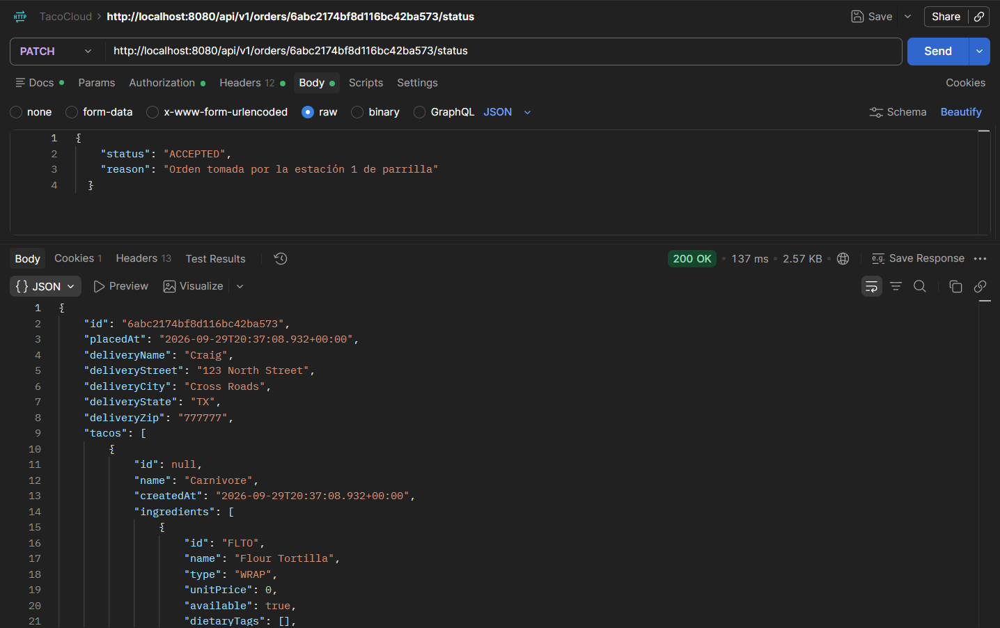
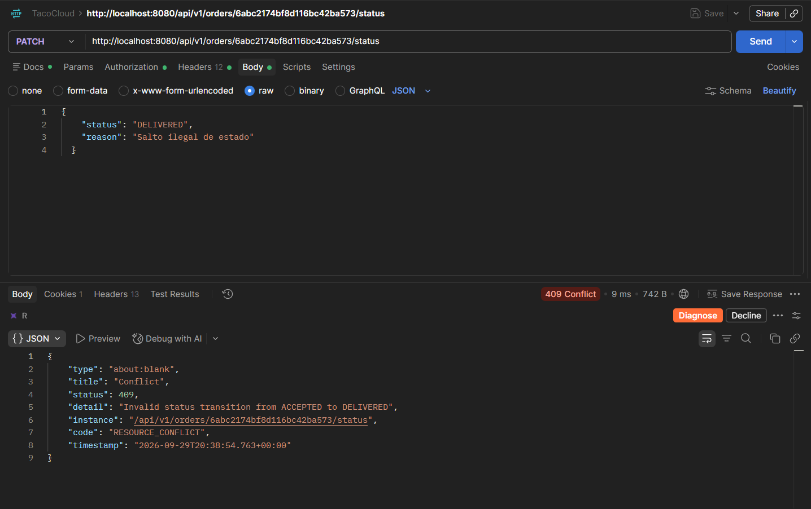
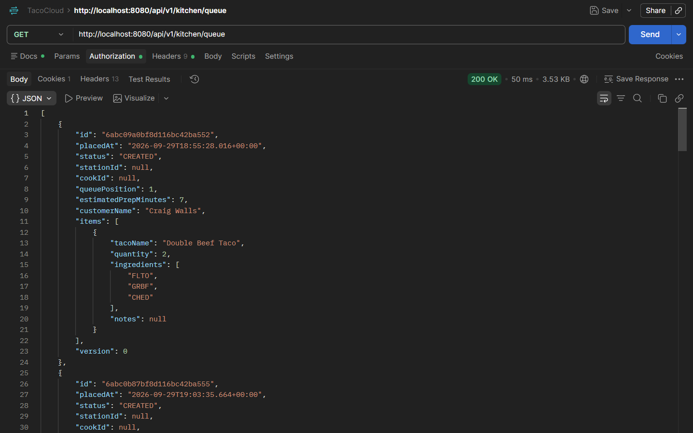
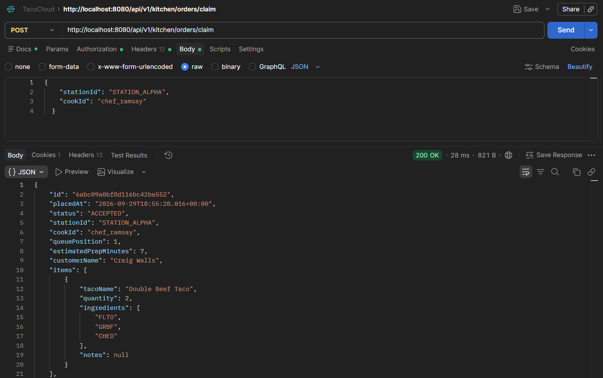
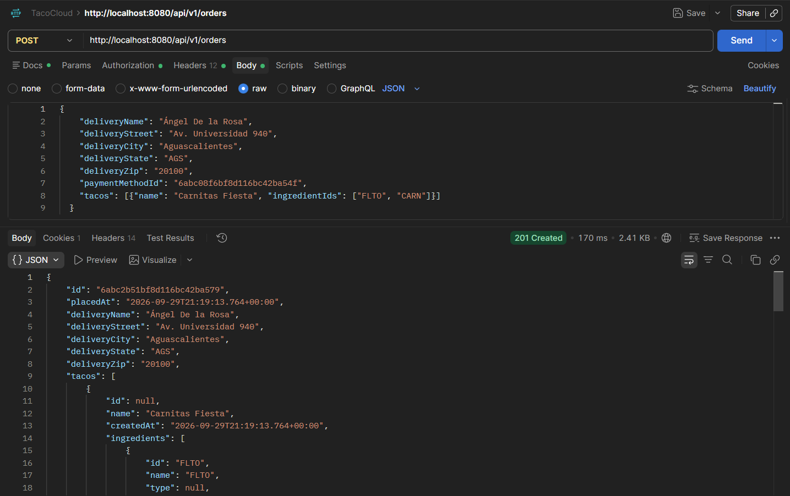
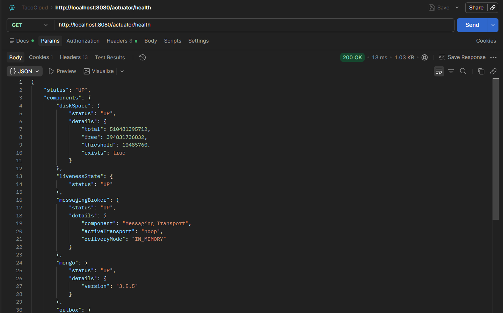
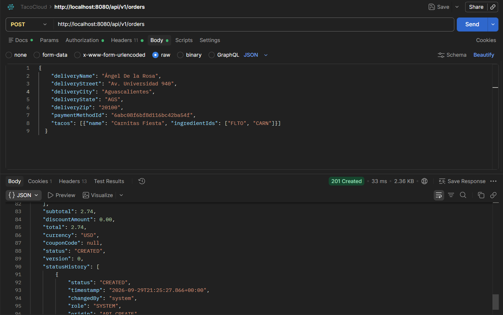
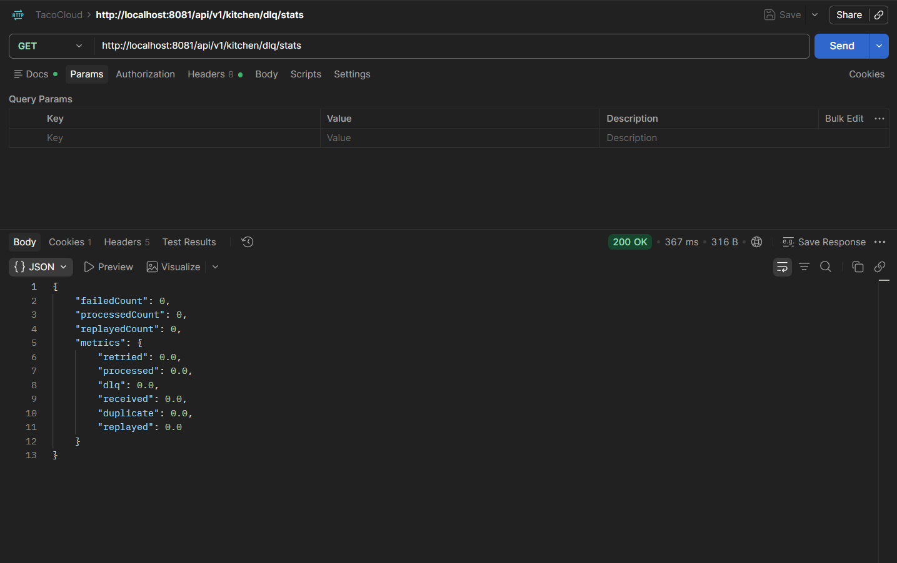

[← Laboratorio 4: Funciones que sí dan ganas de usar](laboratorio-4-funciones-que-si-dan-ganas-de-usar.md) | [Índice General](README.md) | [Laboratorio 6: Operación y calidad →](laboratorio-6-operacion-y-calidad.md)

---

# Laboratorio 5: Cocina y mensajería confiable

## Resumen Ejecutivo del Laboratorio

El **Laboratorio 5** aborda la transformación crítica de Taco Cloud desde una aplicación monolítica con mensajería ingenua ("disparar y olvidar") hacia una arquitectura orientada a eventos distribuida, transaccional, resiliente y de alta confiabilidad. En un entorno culinario y comercial real, la pérdida de un pedido por caída transitoria de un broker de mensajería o el procesamiento duplicado de una orden por reintentos de red representa pérdidas económicas directas y caos en la línea de preparación.

A través de los retos funcionales **TC-25** al **TC-30**, el sistema implementa una máquina de estados determinista para el ciclo de vida de las órdenes con control de concurrencia optimista (`@Version`), un mecanismo de reclamo atómico en cocina con estimación de tiempos de entrega (ETA), un módulo común de contratos de integración agnóstico a la infraestructura (`tacocloud-messaging-contract`), selección dinámica y desacoplada del transporte de mensajería en tiempo de ejecución (JMS, RabbitMQ, Kafka o NoOp), el patrón transaccional **Transactional Outbox** para garantizar entrega atómica de mensajes, y un consumidor de cocina estrictamente idempotente respaldado por Dead Letter Queue (DLQ) y reintentos clasificados.


---

## Reto Funcional TC-25: Flujo de estados de una orden

### 1. Objetivo del Reto y Resultado Funcional
* **Objetivo:** Formalizar el ciclo de vida de los pedidos mediante una máquina de estados determinista con matriz de transiciones permitidas, control estricto de roles autorizados (`ROLE_USER`, `ROLE_KITCHEN`, `ROLE_ADMIN`, `ROLE_DELIVERY`), registro de auditoría inmutable de cada cambio y control de concurrencia optimista (`@Version`).
* **Resultado Funcional:** La entidad `TacoOrder` evoluciona a través de estados válidos (`CREATED` $\rightarrow$ `ACCEPTED` $\rightarrow$ `PREPARING` $\rightarrow$ `READY` $\rightarrow$ `OUT_FOR_DELIVERY` $\rightarrow$ `DELIVERED` o `CANCELLED`). Cualquier intento de salto arbitrario (ej. `CREATED` $\rightarrow$ `DELIVERED`), asignación directa de estado en el payload de creación o intento de modificación con versión desactualizada es rechazado inmediatamente con `409 Conflict` o `403 Forbidden`.

### 2. Archivos Objetivo y Código Base
* [`TacoOrder.java`](../tacocloud-domain-mongodb/src/main/java/tacos/TacoOrder.java): Entidad del dominio enriquecida con `OrderStatus status`, historial auditado `List<OrderStatusHistory>` y `@Version Long version`.
* [`OrderStatus.java`](../tacocloud-domain-mongodb/src/main/java/tacos/order/OrderStatus.java): Enumeración con los estados del ciclo de vida.
* [`OrderWorkflowService.java`](../tacocloud-api/src/main/java/tacos/order/OrderWorkflowService.java): Servicio central con la matriz estática de transiciones, validación de permisos por rol/ownership y gestión de optimistic locking.
* [`OrderApiController.java`](../tacocloud-api/src/main/java/tacos/web/api/OrderApiController.java): Endpoints `PATCH /api/v1/orders/{id}/status` y `POST /api/v1/orders/{id}/cancel`.
* [`OrderStatusUpdateRequest.java`](../tacocloud-api/src/main/java/tacos/web/api/dto/OrderStatusUpdateRequest.java) y [`OrderCancelRequest.java`](../tacocloud-api/src/main/java/tacos/web/api/dto/OrderCancelRequest.java): DTOs de solicitud para avanzar o cancelar el pedido.

### 3. Cambios Realizados y Arquitectura

#### Comparativa de Implementación:

```java
// CÓDIGO ORIGINAL:
// La orden no tenía ciclo de vida ni control de estados; cualquier cliente podía
// sobrescribir la orden completa o pasar estados arbitrarios sin validar roles ni transiciones:
@PatchMapping(path="/{orderId}", consumes="application/json")
public Mono<TacoOrder> patchOrderInsegura(@PathVariable String orderId, @RequestBody TacoOrder patch) {
  return repo.findById(orderId).flatMap(order -> {
    if (patch.getDeliveryName() != null) order.setDeliveryName(patch.getDeliveryName());
    // Sin máquina de estados, sin validación de transiciones y sin bloqueo optimista
    return repo.save(order);
  });
}
```

```java
// CÓDIGO IMPLEMENTADO:
// Matriz de transiciones explícita, validación de roles y detección de colisiones con @Version:
@Service
public class OrderWorkflowService {

  private static final Map<OrderStatus, Map<OrderStatus, Set<String>>> TRANSITION_MATRIX = new HashMap<>();

  static {
    // Definición de matriz canónica de transiciones permitidas y roles autorizados
    Map<OrderStatus, Set<String>> fromCreated = new HashMap<>();
    fromCreated.put(OrderStatus.ACCEPTED, Set.of("ROLE_KITCHEN", "ROLE_ADMIN"));
    fromCreated.put(OrderStatus.CANCELLED, Set.of("ROLE_USER", "ROLE_ADMIN"));
    TRANSITION_MATRIX.put(OrderStatus.CREATED, Collections.unmodifiableMap(fromCreated));

    Map<OrderStatus, Set<String>> fromAccepted = new HashMap<>();
    fromAccepted.put(OrderStatus.PREPARING, Set.of("ROLE_KITCHEN", "ROLE_ADMIN"));
    fromAccepted.put(OrderStatus.CANCELLED, Set.of("ROLE_ADMIN"));
    TRANSITION_MATRIX.put(OrderStatus.ACCEPTED, Collections.unmodifiableMap(fromAccepted));

    Map<OrderStatus, Set<String>> fromPreparing = new HashMap<>();
    fromPreparing.put(OrderStatus.READY, Set.of("ROLE_KITCHEN", "ROLE_ADMIN"));
    fromPreparing.put(OrderStatus.CANCELLED, Set.of("ROLE_ADMIN"));
    TRANSITION_MATRIX.put(OrderStatus.PREPARING, Collections.unmodifiableMap(fromPreparing));

    Map<OrderStatus, Set<String>> fromReady = new HashMap<>();
    fromReady.put(OrderStatus.OUT_FOR_DELIVERY, Set.of("ROLE_DELIVERY", "ROLE_ADMIN"));
    fromReady.put(OrderStatus.CANCELLED, Set.of("ROLE_ADMIN"));
    TRANSITION_MATRIX.put(OrderStatus.READY, Collections.unmodifiableMap(fromReady));

    Map<OrderStatus, Set<String>> fromOutForDelivery = new HashMap<>();
    fromOutForDelivery.put(OrderStatus.DELIVERED, Set.of("ROLE_DELIVERY", "ROLE_ADMIN"));
    TRANSITION_MATRIX.put(OrderStatus.OUT_FOR_DELIVERY, Collections.unmodifiableMap(fromOutForDelivery));

    // Estados terminales
    TRANSITION_MATRIX.put(OrderStatus.DELIVERED, Collections.emptyMap());
    TRANSITION_MATRIX.put(OrderStatus.CANCELLED, Collections.emptyMap());
  }

  public Mono<ResponseEntity<OrderResponse>> updateOrderStatus(
      String orderId, OrderStatusUpdateRequest request, Authentication authentication) {
    return orderRepo.findById(orderId)
        .switchIfEmpty(Mono.error(new ResponseStatusException(HttpStatus.NOT_FOUND, "Order not found")))
        .flatMap(order -> {
          OrderStatus current = order.getStatus();
          OrderStatus target = request.getStatus();

          // Idempotencia: si ya está en el estado objetivo, responder éxito sin duplicar historial
          if (current == target) {
            return Mono.just(ResponseEntity.ok(orderMapper.toResponse(order)));
          }

          // Validación en matriz centralizada
          Map<OrderStatus, Set<String>> allowedTargets = TRANSITION_MATRIX.getOrDefault(current, Collections.emptyMap());
          if (!allowedTargets.containsKey(target)) {
            return Mono.error(new ResponseStatusException(HttpStatus.CONFLICT,
                String.format("Invalid state transition from %s to %s", current, target)));
          }

          // Validación de roles autorizados
          Set<String> requiredRoles = allowedTargets.get(target);
          boolean hasRole = authentication.getAuthorities().stream()
              .map(GrantedAuthority::getAuthority)
              .anyMatch(requiredRoles::contains);
          if (!hasRole) {
            return Mono.error(new ResponseStatusException(HttpStatus.FORBIDDEN,
                "User lacks required role to perform this status transition"));
          }

          order.setStatus(target);
          order.addStatusHistory(new OrderStatusHistory(target, new Date(), authentication.getName(), request.getReason()));

          return orderRepo.save(order)
              .onErrorMap(OptimisticLockingFailureException.class,
                  ex -> new ResponseStatusException(HttpStatus.CONFLICT, "Concurrent modification detected. Please retry."));
        })
        .map(savedOrder -> ResponseEntity.ok(orderMapper.toResponse(savedOrder)));
  }
}
```

### 4. Contratos y Especificación HTTP

* **Actualizar Estado de Orden:**
  * **Método:** `PATCH`
  * **Ruta:** `/api/v1/orders/{id}/status`
  * **Headers:** `Content-Type: application/json`, `Authorization: Basic/Bearer (Rol Autorizado)`
  * **Cuerpo de Solicitud:**
  ```json
  {
    "status": "ACCEPTED",
    "reason": "Orden aceptada en cocina para preparación",
    "version": 0
  }
  ```
  * **Cuerpo de Respuesta (200 OK):**
  ```json
  {
    "id": "60c72b2f9b1d8b2bad749999",
    "status": "ACCEPTED",
    "placedAt": "2026-09-28T18:30:00.000Z",
    "version": 1,
    "statusHistory": [
      {
        "status": "CREATED",
        "changedAt": "2026-09-28T18:30:00.000Z",
        "changedBy": "customer1",
        "reason": "Order created"
      },
      {
        "status": "ACCEPTED",
        "changedAt": "2026-09-28T18:32:15.000Z",
        "changedBy": "chef_ramsay",
        "reason": "Orden aceptada en cocina para preparación"
      }
    ]
  }
  ```

* **Cancelar Orden por el Usuario:**
  * **Método:** `POST`
  * **Ruta:** `/api/v1/orders/{id}/cancel`
  * **Headers:** `Content-Type: application/json`, `Authorization: Basic/Bearer (Owner)`
  * **Cuerpo de Solicitud:**
  ```json
  {
    "reason": "El cliente solicitó cancelar antes de entrar a preparación"
  }
  ```
  * **Códigos de Estado:**
    * `200 OK`: Orden cancelada con éxito (únicamente si se encontraba en estado `CREATED`).
    * `403 FORBIDDEN`: El usuario no es el dueño de la orden o no posee permisos para la transición.
    * `409 CONFLICT`: Transición inválida (ej. intentar cancelar una orden que ya está `PREPARING` o `READY`) o colisión de concurrencia (`@Version`).

### 5. Guía de Pruebas en Postman

#### Configuración de la Solicitud 1: Avance Válido de Estado por Cocina (200 OK)
* **Method:** `PATCH`
* **URL:** `http://localhost:8080/api/v1/orders/60c72b2f9b1d8b2bad749999/status`
* **Auth:** Basic Auth (`kitchen` / `kitchen123`) o Bearer Token con `ROLE_KITCHEN`
* **Headers:**
  * `Content-Type: application/json`
  * `Accept: application/json`
* **Body (raw JSON):**
```json
{
  "status": "ACCEPTED",
  "reason": "Orden tomada por la estación 1 de parrilla"
}
```

#### Comando cURL - Caso de Éxito Transición Autorizada
```bash
curl -X PATCH "http://localhost:8080/api/v1/orders/60c72b2f9b1d8b2bad749999/status" \
  -u "kitchen:kitchen123" \
  -H "Content-Type: application/json" \
  -H "Accept: application/json" \
  -d '{
    "status": "ACCEPTED",
    "reason": "Orden tomada por la estación 1 de parrilla"
  }'
```

#### Comando cURL - Caso de Conflicto de Transición Inválida (409 Conflict)
```bash
# Intento de saltar directamente desde CREATED hacia DELIVERED
curl -X PATCH "http://localhost:8080/api/v1/orders/60c72b2f9b1d8b2bad749999/status" \
  -u "kitchen:kitchen123" \
  -H "Content-Type: application/json" \
  -H "Accept: application/json" \
  -d '{
    "status": "DELIVERED",
    "reason": "Salto ilegal de estado"
  }'
```

### 6. Espacio para Evidencias





### 7. Pregunta Oficial para Defender la Solución

**Pregunta para Defender la Solución**: *¿El estado debe ser sólo un enum o una máquina de estados explícita? ¿Qué complejidad justifica cada opción?*

**Defensa Técnica**:
> **Un `enum` por sí solo representa únicamente una lista de valores constantes, mientras que una máquina de estados explícita gobierna las invariantes del negocio, las reglas de transición y la seguridad del sistema**.
>
> 1. **Cuándo basta un Enum simple:** Un `enum` aislado es adecuado únicamente en etapas iniciales o modelos CRUD triviales donde el orden de los estados no tiene impacto financiero ni operativo (por ejemplo, categorías estáticas de artículos o etiquetas de interfaz).
> 2. **Por qué se requiere una Máquina de Estados Explícita en Taco Cloud:**
>    - **Seguridad y Control de Acceso Basado en Rol (RBAC):** Ciertas transiciones sólo pueden ser ejecutadas por actores específicos (ej. el cliente puede cancelar en `CREATED`, pero sólo un cocinero puede pasar a `ACCEPTED`, y sólo un repartidor a `DELIVERED`). Un enum no puede validar quién invoca el cambio.
>    - **Efectos Secundarios Obligatorios:** Avanzar a `CANCELLED` exige liberar stock en el inventario; avanzar a `READY` dispara notificaciones al cliente.
>    - **Invarianza y Auditoría:** Impide saltos ilegales (como `CREATED` $\rightarrow$ `DELIVERED` sin cocinar ni pagar) y garantiza un registro histórico inmutable de timestamps, responsables y motivos.
>
> La complejidad de centralizar una matriz de transiciones formal en `OrderWorkflowService` está plenamente justificada al proteger la consistencia operativa y contable del negocio.

### 8. Criterios de Aceptación
- [x] Flujo canónico `CREATED` $\rightarrow$ `ACCEPTED` $\rightarrow$ `PREPARING` $\rightarrow$ `READY` $\rightarrow$ `OUT_FOR_DELIVERY` $\rightarrow$ `DELIVERED` operativo.
- [x] Saltos ilegales rechazados con `409 CONFLICT`.
- [x] Control estricto de roles: clientes no pueden marcar `DELIVERED`; cocina no puede alterar ownership.
- [x] Bloqueo optimista con `@Version`: modificaciones concurrentes sobre versiones obsoletas devuelven conflicto.
- [x] Historial cronológico ordenado que registra actor, timestamp y razón de cada cambio.

---

## Reto Funcional TC-26: Cola de cocina, claim atómico y tiempo estimado

### 1. Objetivo del Reto y Resultado Funcional
* **Objetivo:** Implementar una cola operativa para las estaciones de cocina que permita visualizar pedidos pendientes (`CREATED`), realizar el reclamo atómico del siguiente pedido sin condiciones de carrera entre múltiples cocineros y calcular un tiempo estimado de entrega (ETA) determinista basado en el tamaño y la complejidad de los tacos en espera.
* **Resultado Funcional:** La estación de cocina consulta `GET /api/v1/kitchen/queue` (orden FIFO por `placedAt` y `_id`) y ejecuta `POST /api/v1/kitchen/orders/claim`. La operación utiliza `findAndModify` atómico en MongoDB, cambiando de inmediato el estado a `ACCEPTED` y asociando la estación (`stationId`) y el cocinero (`cookId`), asegurando que dos cocineros concurrentes jamás tomen la misma orden. Los datos sensibles de pago y dirección permanecen completamente ocultos para el personal de cocina.

### 2. Archivos Objetivo y Código Base
* [`KitchenApiController.java`](../tacocloud-api/src/main/java/tacos/kitchen/KitchenApiController.java): Endpoints REST `/api/v1/kitchen/queue`, `/orders/claim` y `/orders/{id}/status`.
* [`KitchenQueueService.java`](../tacocloud-api/src/main/java/tacos/kitchen/KitchenQueueService.java): Lógica de cola FIFO y reclamo atómico mediante `ReactiveMongoTemplate.findAndModify`.
* [`KitchenEtaCalculator.java`](../tacocloud-api/src/main/java/tacos/kitchen/KitchenEtaCalculator.java): Algoritmo de cálculo determinista de ETA según tacos, ingredientes cocinados y órdenes precedentes.
* [`KitchenOrderDto.java`](../tacocloud-api/src/main/java/tacos/kitchen/dto/KitchenOrderDto.java): DTO seguro para cocina sin información de tarjetas, CVV ni dirección completa.
* [`KitchenClaimRequest.java`](../tacocloud-api/src/main/java/tacos/kitchen/dto/KitchenClaimRequest.java): Payload para identificar `stationId` y `cookId`.

### 3. Cambios Realizados y Arquitectura

#### Comparativa de Implementación:

```java
// CÓDIGO ORIGINAL:
// Reclamo no atómico mediante lectura previa (read-then-save), ocasionando
// condiciones de carrera donde dos estaciones reclamaban la misma orden simultáneamente:
public Mono<TacoOrder> claimOrderInseguro(String stationId) {
  return orderRepo.findAll()
      .filter(o -> o.getStatus() == OrderStatus.CREATED)
      .next()
      .flatMap(order -> {
        // Otra estación de cocina puede leer la misma orden antes de que ésta se guarde
        order.setStatus(OrderStatus.ACCEPTED);
        order.setAssignedStation(stationId);
        return orderRepo.save(order);
      });
}
```

```java
// CÓDIGO IMPLEMENTADO:
// Operación atómica findAndModify a nivel de motor de base de datos y cálculo de ETA determinista:
public Mono<KitchenOrderDto> claimNext(KitchenClaimRequest request, Authentication auth) {
  final String stationId = resolveStationId(request);
  final String cookId = resolveCookId(request, auth);

  // Consulta atómica: busca la primera orden CREATED por orden FIFO y cambia su estado en un solo ciclo
  Query query = new Query(Criteria.where("status").is(OrderStatus.CREATED))
      .with(Sort.by(Sort.Direction.ASC, "placedAt", "_id"));

  Update update = new Update()
      .set("status", OrderStatus.ACCEPTED)
      .set("assignedStation", stationId)
      .set("assignedCook", cookId)
      .set("claimedAt", new Date())
      .push("statusHistory", new OrderStatusHistory(OrderStatus.ACCEPTED, new Date(), cookId, "Reclamada por estación " + stationId));

  FindAndModifyOptions options = FindAndModifyOptions.options().returnNew(true);

  return mongoTemplate.findAndModify(query, update, options, TacoOrder.class)
      .flatMap(claimedOrder -> {
        log.info("[KITCHEN] Order '{}' atomically claimed by station '{}' (cook: '{}')",
            claimedOrder.getId(), stationId, cookId);
        return calculatePrecedingAndMapDto(claimedOrder);
      });
}
```

### 4. Contratos y Especificación HTTP

* **Consultar Cola de Cocina:**
  * **Método:** `GET`
  * **Ruta:** `/api/v1/kitchen/queue`
  * **Headers:** `Authorization: Bearer/Basic (ROLE_KITCHEN)`
  * **Cuerpo de Respuesta (200 OK):**
  ```json
  [
    {
      "orderId": "60c72b2f9b1d8b2bad749999",
      "status": "CREATED",
      "placedAt": "2026-09-28T18:30:00.000Z",
      "queuePosition": 1,
      "estimatedPrepMinutes": 8,
      "items": [
        {
          "tacoName": "Carnitas Fiesta",
          "quantity": 2,
          "ingredients": ["Flour Tortilla", "Carnitas", "Salsa"]
        }
      ]
    }
  ]
  ```

* **Reclamar Siguiente Orden:**
  * **Método:** `POST`
  * **Ruta:** `/api/v1/kitchen/orders/claim`
  * **Headers:** `Content-Type: application/json`, `Authorization: Bearer/Basic (ROLE_KITCHEN)`
  * **Cuerpo de Solicitud:**
  ```json
  {
    "stationId": "GRILL-STATION-2",
    "cookId": "chef_ramsay"
  }
  ```
  * **Códigos de Estado:**
    * `200 OK`: Orden reclamada exitosamente, retornando el DTO con `assignedStation` y `assignedCook`.
    * `204 NO CONTENT`: La cola está vacía; no hay órdenes en estado `CREATED` para preparar.

### 5. Guía de Pruebas en Postman

#### Configuración de la Solicitud 1: Consultar Cola de Cocina
* **Method:** `GET`
* **URL:** `http://localhost:8080/api/v1/kitchen/queue`
* **Auth:** Basic Auth (`kitchen` / `kitchen123`)
* **Headers:**
  * `Accept: application/json`
* **Body:** None

#### Comando cURL - Consultar Cola FIFO con ETA
```bash
curl -X GET "http://localhost:8080/api/v1/kitchen/queue" \
  -u "kitchen:kitchen123" \
  -H "Accept: application/json"
```

#### Comando cURL - Reclamar Atómicamente la Siguiente Orden
```bash
curl -X POST "http://localhost:8080/api/v1/kitchen/orders/claim" \
  -u "kitchen:kitchen123" \
  -H "Content-Type: application/json" \
  -H "Accept: application/json" \
  -d '{
    "stationId": "STATION_ALPHA",
    "cookId": "chef_ramsay"
  }'
```

### 6. Espacio para Evidencias





### 7. Pregunta Oficial para Defender la Solución

**Pregunta para Defender la Solución**: *¿FIFO puro es justo cuando una orden enorme bloquea veinte órdenes pequeñas?*

**Defensa Técnica**:
> **El despacho FIFO (First-In, First-Out) estricto garantiza equidad temporal básica, pero introduce el problema del "bloqueo de cabeza de línea" (*Head-of-Line Blocking* o Efecto Convoy)**.
>
> 1. **Vulnerabilidad de FIFO Puro:** Si un cliente corporativo ordena 80 tacos personalizados (requiriendo 45 minutos de cocción ininterrumpida), todos los pedidos individuales posteriores de 1 taco sufren un incremento desproporcionado en su tiempo de espera percibido, destruyendo la satisfacción del cliente general.
> 2. **Estrategia Óptima en Sistemas de Cocina:**
>    - **Particionamiento por Línea de Preparación:** Separar pedidos masivos hacia estaciones de catering dedicadas o "líneas de ensamble secundarias".
>    - **Colas con Prioridad Ponderada (Weighted Fair Queuing) o Shortest Job First (SJF) acotado:** Atender pedidos rápidos intercalados sin permitir que el pedido grande sufra inanición (*starvation*) mediante envejecimiento progresivo (*aging priority*).
> 3. **Implementación en Taco Cloud:** Se preserva el orden base FIFO por transparencia comercial y predictibilidad de auditoría, pero el cálculo dinámico de `estimatedPrepMinutes` refleja de forma determinista la carga acumulada previa, comunicando la realidad operativa al cliente antes de que realice el pedido.

### 8. Criterios de Aceptación
- [x] Reclamo atómico garantizado mediante `findAndModify`: dos estaciones concurrentes jamás reciben la misma orden.
- [x] Cola organizada en estricto orden FIFO por `(placedAt, _id)`.
- [x] Cálculo determinista de ETA en función de la posición en cola y cantidad/tipo de ingredientes.
- [x] El DTO de cocina no incluye información de pago, tarjetas de crédito ni datos privados de entrega.

---

## Reto Funcional TC-27: Contrato único de eventos de orden

### 1. Objetivo del Reto y Resultado Funcional
* **Objetivo:** Unificar la integración asíncrona entre módulos extrayendo un contrato de eventos formal, canónico y desacoplado en un nuevo artefacto Maven independiente (`tacocloud-messaging-contract`), eliminando interfaces duplicadas y dependencias indebidas de entidades de persistencia MongoDB en la capa de mensajería.
* **Resultado Funcional:** Todos los publicadores y consumidores (JMS, RabbitMQ, Kafka y Cocina) compilan contra la misma especificación inmutable `OrderEvent` versionada (v1). Los eventos contienen identificadores globales (`eventId`, `correlationId`), marca de tiempo (`occurredAt`) y una instantánea limpia de la orden (`OrderEventPayload`) estrictamente libre de información bancaria (sin PAN, CVV ni contraseñas).

### 2. Archivos Objetivo y Código Base
* Módulo: `tacocloud/tacocloud-messaging-contract`
* [`OrderEvent.java`](../tacocloud-messaging-contract/src/main/java/tacos/messaging/OrderEvent.java): POJO inmutable que define la estructura canónica del mensaje con versión semántica.
* [`OrderEventType.java`](../tacocloud-messaging-contract/src/main/java/tacos/messaging/OrderEventType.java): Tipos de eventos soportados (`ORDER_CREATED`, `ORDER_STATUS_CHANGED`, `ORDER_CANCELLED`).
* [`OrderEventPayload.java`](../tacocloud-messaging-contract/src/main/java/tacos/messaging/OrderEventPayload.java): Contenedor de datos del pedido con ítems e ingredientes requeridos por cocina.
* [`OrderMessagingService.java`](../tacocloud-messaging-contract/src/main/java/tacos/messaging/OrderMessagingService.java): Puerto común de mensajería (Arquitectura Hexagonal).
* [`OrderEventMapper.java`](../tacocloud-api/src/main/java/tacos/order/OrderEventMapper.java): Mapper que transforma la entidad `TacoOrder` al contrato seguro `OrderEvent`.

### 3. Cambios Realizados y Arquitectura

#### Comparativa de Implementación:

```java
// CÓDIGO ORIGINAL:
// Serialización directa de la entidad de base de datos 'TacoOrder' en los brokers,
// acoplando los consumidores al esquema de MongoDB y exponiendo datos sensibles de tarjetas:
public class TacoOrder implements Serializable {
  // @Document acoplado a persistencia
  private String id;
  private String ccNumber; // Dato Bancario
  private String ccCVV;    // Dato Critico
  private User user;       // Serializaba la entidad completa de usuario con password hash
}
```

```java
// CÓDIGO IMPLEMENTADO:
// Contrato inmutable desacoplado en tacocloud-messaging-contract sin dependencias de infraestructura:
package tacos.messaging;

@Data
@NoArgsConstructor
@AllArgsConstructor
@Builder
public class OrderEvent implements Serializable {
  private static final long serialVersionUID = 1L;

  private String eventId;          // UUID global único para deduplicación e idempotencia
  private OrderEventType eventType;// ORDER_CREATED, ORDER_STATUS_CHANGED, ORDER_CANCELLED
  private int version;             // Versión del esquema del contrato (ej. 1)
  private Date occurredAt;         // Timestamp del suceso en origen
  private String correlationId;    // Trazabilidad distribuida de la petición HTTP
  private OrderEventPayload payload; // Snapshot operacional limpio sin datos sensibles
}

@Data
@Builder
public class OrderEventPayload implements Serializable {
  private String orderId;
  private String status;
  private String deliveryName;
  private List<OrderEventItemPayload> items; // Tacos e ingredientes para elaboración
}
```

### 4. Contratos y Especificación HTTP

* **Especificación del Mensaje de Evento (JSON Canónico):**
```json
{
  "eventId": "c7a8b4e1-2f3a-4d5e-8b1c-9a0e1f2b3c4d",
  "eventType": "ORDER_CREATED",
  "version": 1,
  "occurredAt": "2026-09-28T18:30:00.000Z",
  "correlationId": "req-987123-abc",
  "payload": {
    "orderId": "60c72b2f9b1d8b2bad749999",
    "status": "CREATED",
    "deliveryName": "Ángel De la Rosa",
    "items": [
      {
        "tacoName": "Carnitas Fiesta",
        "quantity": 2,
        "ingredients": [
          { "id": "FLTO", "name": "Flour Tortilla" },
          { "id": "CARN", "name": "Carnitas" }
        ]
      }
    ]
  }
}
```
* **Garantías del Contrato:**
  * Estrictamente agnóstico a frameworks: el módulo no importa Spring, MongoDB, JMS, RabbitMQ ni Kafka.
  * Inmunidad PCI-DSS: campos `ccNumber`, `ccCVV`, `ccExpiration` y contraseñas jamás forman parte del payload.

### 5. Guía de Pruebas en Postman

*(Los contratos de mensajería asíncrona se verifican a través del endpoint de creación de pedidos que origina el evento).*

> [!TIP]
> **Pasos Previos para la Creación de la Orden**:
> 1. **Identificador del Método de Pago**: Consulta `GET http://localhost:8080/api/v1/payment-methods` (Basic Auth `habuma` / `password`) y utiliza el campo `"id"` devuelto (ejemplo: `"6abc08f6bf8d116bc42ba54f"`).
> 2. **Estructura de Ingredientes en el DTO**: El DTO `TacoRequest` recibe la lista de identificadores de ingredientes bajo la propiedad **`ingredientIds`** (array de strings).

#### Configuración de la Solicitud: Colocación de Orden que Despacha el Evento
* **Method:** `POST`
* **URL:** `http://localhost:8080/api/v1/orders`
* **Auth:** Basic Auth (`habuma` / `password`)
* **Headers:**
  * `Content-Type: application/json`
  * `X-Correlation-ID: postman-corr-tc27`
* **Body (raw JSON):**
```json
{
  "deliveryName": "Ángel De la Rosa",
  "deliveryStreet": "Av. Universidad 940",
  "deliveryCity": "Aguascalientes",
  "deliveryState": "AGS",
  "deliveryZip": "20100",
  "paymentMethodId": "6abc08f6bf8d116bc42ba54f",
  "tacos": [
    {
      "name": "Carnitas Fiesta",
      "ingredientIds": ["FLTO", "CARN"]
    }
  ]
}
```

* **Respuesta Esperada (201 Created):**
```json
{
  "id": "6abc292abf8d116bc42ba576",
  "placedAt": "2026-09-29T21:10:02.206+00:00",
  "deliveryName": "Ángel De la Rosa",
  "deliveryStreet": "Av. Universidad 940",
  "deliveryCity": "Aguascalientes",
  "deliveryState": "AGS",
  "deliveryZip": "20100",
  "username": "habuma",
  "brand": "VISA",
  "last4": "4111",
  "status": "CREATED"
}
```

#### Comando cURL - Publicación de Orden con Trazabilidad
```bash
curl -X POST "http://localhost:8080/api/v1/orders" \
  -u "habuma:password" \
  -H "Content-Type: application/json" \
  -H "X-Correlation-ID: trace-contract-tc27" \
  -d '{
    "deliveryName": "Ángel De la Rosa",
    "deliveryStreet": "Av. Universidad 940",
    "deliveryCity": "Aguascalientes",
    "deliveryState": "AGS",
    "deliveryZip": "20100",
    "paymentMethodId": "6abc08f6bf8d116bc42ba54f",
    "tacos": [{"name": "Carnitas Fiesta", "ingredientIds": ["FLTO", "CARN"]}]
  }'
```

### 6. Espacio para Evidencias



### 7. Pregunta Oficial para Defender la Solución

**Pregunta para Defender la Solución**: *¿Compartir una entidad de dominio por JAR es lo mismo que definir un contrato de integración?*

**Defensa Técnica**:
> **No. Compartir entidades de dominio mediante un JAR compartido es un antipatrón clásico de acoplamiento rígido (*Distributed Monolith*), mientras que un contrato de integración formal es una frontera arquitectónica explícita y versionada**.
>
> 1. **Riesgos de Compartir Entidades de Dominio:**
>    - Si el equipo de persistencia modifica una anotación `@Document`, un nombre de columna o la estructura interna de `TacoOrder`, rompe inmediatamente a todos los consumidores distribuidos que compartían ese JAR.
>    - Se filtran campos internos, datos sensibles de pago (CVV, tarjetas) o detalles de auditoría que los sistemas externos no requieren conocer.
> 2. **Ventajas de un Contrato de Integración (`OrderEvent`):**
>    - **Autonomía y Desacoplamiento:** Los servicios solo conocen un esquema público estable, diseñado para evolucionar con compatibilidad hacia atrás (*backward compatibility*).
>    - **Seguridad por Diseño:** El DTO de integración solo transporta las instantáneas necesarias para la operación culinaria, garantizando cumplimiento normativo (PCI-DSS, GDPR).
>    - **Independencia Tecnológica:** El módulo de contrato no arrastra dependencias pesadas de Spring Data ni controladores de bases de datos.

### 8. Criterios de Aceptación
- [x] Módulo `tacocloud-messaging-contract` centralizado sin dependencias de infraestructura ni de base de datos.
- [x] Eliminación total de datos sensibles bancarios y contraseñas del cuerpo del evento.
- [x] Identificadores globales obligatorios en cada mensaje: `eventId`, `correlationId`, `version` y `occurredAt`.
- [x] Adaptadores de JMS, RabbitMQ, Kafka y Cocina compilan contra el mismo puerto `OrderMessagingService`.

---

## Reto Funcional TC-28: Elegir broker en runtime, no editando el POM

### 1. Objetivo del Reto y Resultado Funcional
* **Objetivo:** Permitir la selección del transporte de mensajería (NoOp, JMS/ActiveMQ, RabbitMQ o Apache Kafka) en tiempo de ejecución mediante propiedades externas (`tacocloud.messaging.transport`), eliminando la necesidad de alterar etiquetas en los archivos `pom.xml` o recompilar el proyecto para cambiar de intermediario.
* **Resultado Funcional:** La aplicación arranca activando exactamente un bean de `OrderMessagingService`. Si se define un transporte inexistente o inválido, el arranque de Spring falla tempranamente (*fail-fast*) con un mensaje de diagnóstico claro. Los parámetros de conexión y destinos son completamente externos.

### 2. Archivos Objetivo y Código Base
* [`MessagingTransportConfiguration.java`](../tacocloud-api/src/main/java/tacos/messaging/config/MessagingTransportConfiguration.java): Configuración condicional con `@ConditionalOnProperty`.
* [`MessagingTransportEnvironmentPostProcessor.java`](../tacocloud-api/src/main/java/tacos/messaging/config/MessagingTransportEnvironmentPostProcessor.java): Validación temprana de variables de entorno y transporte seleccionado.
* [`tacocloud-messaging-noop`](../tacocloud-messaging-noop): Adaptador en memoria para pruebas locales y desarrollo sin brokers activos.
* [`tacocloud-messaging-jms`](../tacocloud-messaging-jms), [`tacocloud-messaging-rabbitmq`](../tacocloud-messaging-rabbitmq), [`tacocloud-messaging-kafka`](../tacocloud-messaging-kafka): Adaptadores específicos para cada tecnología.
* [`application.yml`](../tacocloud-api/src/main/resources/application.yml): Configuración con propiedad `tacocloud.messaging.transport=noop`.

### 3. Cambios Realizados y Arquitectura

#### Comparativa de Implementación:

```java
// CÓDIGO ORIGINAL:
// El cambio de broker obligaba a comentar y descomentar dependencias en el pom.xml:
// <!-- Para usar Kafka, descomente esto y comente JMS en el pom.xml -->
// <dependency>
//   <groupId>tacos</groupId>
//   <artifactId>tacocloud-messaging-kafka</artifactId>
// </dependency>
```

```java
// CÓDIGO IMPLEMENTADO:
// Todos los módulos forman parte del runtime; la activación es condicional por propiedad en runtime:
@Configuration
public class MessagingTransportConfiguration {

  @Configuration
  @ConditionalOnProperty(name = "tacocloud.messaging.transport", havingValue = "noop", matchIfMissing = false)
  static class NoopConfiguration {
    @Bean
    public OrderMessagingService noopMessagingService() {
      return new NoopOrderMessagingService();
    }
  }

  @Configuration
  @ConditionalOnProperty(name = "tacocloud.messaging.transport", havingValue = "jms")
  static class JmsConfiguration {
    @Bean
    public OrderMessagingService jmsMessagingService(JmsTemplate jmsTemplate, Destination destination) {
      return new JmsOrderMessagingService(jmsTemplate, destination);
    }
  }

  @Configuration
  @ConditionalOnProperty(name = "tacocloud.messaging.transport", havingValue = "rabbit")
  static class RabbitConfiguration {
    @Bean
    public OrderMessagingService rabbitMessagingService(RabbitTemplate rabbitTemplate) {
      return new RabbitOrderMessagingService(rabbitTemplate);
    }
  }

  @Configuration
  @ConditionalOnProperty(name = "tacocloud.messaging.transport", havingValue = "kafka")
  static class KafkaConfiguration {
    @Bean
    public OrderMessagingService kafkaMessagingService(KafkaTemplate<String, OrderEvent> kafkaTemplate) {
      return new KafkaOrderMessagingService(kafkaTemplate);
    }
  }
}
```

### 4. Contratos y Especificación HTTP

* **Propiedad de Configuración Central:**
  * `tacocloud.messaging.transport=noop|jms|rabbit|kafka`
* **Endpoint de Salud e Inspección del Broker:**
  * **Método:** `GET`
  * **Ruta:** `/actuator/health`
  * **Cuerpo de Respuesta (Fragmento):**
  ```json
  {
    "status": "UP",
    "components": {
      "messagingBroker": {
        "status": "UP",
        "details": {
          "activeTransport": "noop",
          "provider": "NoOpOrderMessagingService"
        }
      }
    }
  }
  ```

### 5. Guía de Pruebas en Postman

#### Configuración de la Solicitud 1: Verificar Transporte Activo en Actuator
* **Method:** `GET`
* **URL:** `http://localhost:8080/actuator/health`
* **Headers:**
  * `Accept: application/json`
* **Body:** None

#### Comando cURL - Inspección del Broker Activo
```bash
curl -X GET "http://localhost:8080/actuator/health" \
  -H "Accept: application/json"
```

#### Comando de Ejecución Alternando Broker Sin Recompilar
```powershell
# Iniciar Taco Cloud utilizando RabbitMQ mediante bandera JVM:
java -Dtacocloud.messaging.transport=rabbit -jar tacocloud/target/tacocloud-0.0.17-SNAPSHOT.jar
```

### 6. Espacio para Evidencias



### 7. Pregunta Oficial para Defender la Solución

**Pregunta para Defender la Solución**: *¿Es mejor perfil o propiedad? ¿Qué pasa cuando se activan dos perfiles por accidente?*

**Defensa Técnica**:
> **Para seleccionar un componente de infraestructura mutuamente excluyente, es significativamente más seguro y robusto utilizar una propiedad (`tacocloud.messaging.transport`) con validación condicional que depender de perfiles de Spring (`@Profile`)**.
>
> 1. **El Peligro de los Perfiles Concurrentes:** Los perfiles de Spring están diseñados para ser acumulativos (ej. `spring.profiles.active=prod,aws,rabbit`). Si un operador activa por error dos perfiles simultáneamente (`jms,rabbit`), Spring intentará instanciar ambos adaptadores. Si no existe una directiva `@Primary` o desambiguación explícita, la aplicación fallará con `NoUniqueBeanDefinitionException` al resolver `OrderMessagingService`, o peor aún, publicará inadvertidamente los mensajes en dos sistemas distintos.
> 2. **Ventaja de la Propiedad Explícita:** La directiva `@ConditionalOnProperty(name = "tacocloud.messaging.transport", havingValue = "...")` evalúa un único valor escalar. Un valor solo puede ser una cadena a la vez, garantizando unicidad estricta.
> 3. **Mecanismo Fail-Fast:** Al combinarlo con un `EnvironmentPostProcessor`, si el valor suministrado no coincide con el catálogo soportado (`noop`, `jms`, `rabbit`, `kafka`), la aplicación interrumpe su secuencia de inicio con un error claro y legible en el log, protegiendo al sistema contra arranques en estados inconsistentes.

### 8. Criterios de Aceptación
- [x] Todos los adaptadores (NoOp, JMS, RabbitMQ, Kafka) residen en el classpath sin colisión de beans.
- [x] Se inicializa exactamente una instancia de `OrderMessagingService` según la propiedad configurada.
- [x] La aplicación falla al inicio con mensaje claro si se proporciona un valor desconocido.
- [x] El transporte se conmuta por línea de comandos o variable de entorno sin necesidad de recompilar el JAR.

---

## Reto Funcional TC-29: Outbox transaccional para no perder órdenes

### 1. Objetivo del Reto y Resultado Funcional
* **Objetivo:** Resolver el problema de consistencia dual (Dual-Write Problem) entre la base de datos MongoDB y el broker de mensajería implementando el patrón **Transactional Outbox**, garantizando que la persistencia de la orden y el registro del evento ocurran como una única decisión transaccional local atómica.
* **Resultado Funcional:** Al confirmar una orden en `POST /api/v1/orders`, se ejecuta una transacción local en MongoDB (`ReactiveMongoTransactionManager`) que guarda el documento `TacoOrder` y un registro `OutboxEvent` con estado `NEW`. Un publicador desacoplado en segundo plano (`OutboxPublisher`) reclama lotes con bloqueo atómico (`FindAndModify`), entrega los mensajes al broker activo y los marca como `PUBLISHED`. Si el broker se encuentra caído o inalcanzable, la orden jamás se pierde: el evento permanece en la base de datos y se reintenta automáticamente con backoff exponencial.

### 2. Archivos Objetivo y Código Base
* [`OutboxEvent.java`](../tacocloud-api/src/main/java/tacos/outbox/OutboxEvent.java): Documento de la colección `order_outbox` con `eventId`, `eventType`, `payload`, `status` (`NEW`, `PUBLISHING`, `PUBLISHED`, `FAILED`), `attempts` y `lockedUntil`.
* [`OutboxEventRepository.java`](../tacocloud-api/src/main/java/tacos/outbox/OutboxEventRepository.java): Repositorio para la gestión de la bandeja de salida.
* [`OutboxService.java`](../tacocloud-api/src/main/java/tacos/outbox/OutboxService.java): Consultas atómicas de reclamo y control de lease de eventos pendientes.
* [`OutboxPublisher.java`](../tacocloud-api/src/main/java/tacos/outbox/OutboxPublisher.java): Tarea periódica programada (`@Scheduled`) que extrae eventos, los despacha mediante `OrderMessagingService` y actualiza estados.
* [`OrderPlacementService.java`](../tacocloud-api/src/main/java/tacos/order/OrderPlacementService.java): Caso de uso transaccional que persiste orden y evento dentro del mismo bloque `@Transactional`.

### 3. Cambios Realizados y Arquitectura

#### Comparativa de Implementación:

```java
// CÓDIGO ORIGINAL:
// Escritura dual no transaccional: si el broker fallaba después de guardar la orden,
// la orden existía en base de datos pero la cocina jamás se enteraba de su existencia:
public Mono<TacoOrder> placeOrderInseguro(TacoOrder order) {
  return orderRepo.save(order)
      .flatMap(saved -> {
        // Falla: Si el broker de mensajería está caído o hay timeout de red, la cocina nunca recibe el pedido pero el cliente ya pagó.
        return orderMessagingService.sendOrder(saved)
            .thenReturn(saved);
      });
}
```

```java
// CÓDIGO IMPLEMENTADO:
// Transacción atómica local (Order + Outbox) y proceso de entrega en segundo plano con OutboxPublisher:
@Transactional
public Mono<TacoOrder> placeOrder(TacoOrder order, String correlationId) {
  return orderRepo.save(order)
      .flatMap(savedOrder -> {
        // 1. Construir el evento formal bajo el contrato canónico
        OrderEvent event = orderEventMapper.toOrderCreatedEvent(savedOrder, correlationId);

        // 2. Persistir en la colección outbox dentro de la MISMA transacción de MongoDB
        OutboxEvent outboxRecord = OutboxEvent.builder()
            .eventId(event.getEventId())
            .eventType(event.getEventType().name())
            .payload(serializePayload(event))
            .status(OutboxStatus.NEW)
            .attempts(0)
            .maxAttempts(5)
            .createdAt(new Date())
            .build();

        return outboxService.save(outboxRecord)
            .thenReturn(savedOrder);
      });
}

// En OutboxPublisher.java (Relay Asíncrono):
@Scheduled(fixedDelayString = "${taco.outbox.poll-interval-ms:2000}")
public void processOutboxBacklog() {
  outboxService.claimBatchForPublishing(batchSize, leaseDurationMs)
      .flatMap(event -> {
        return messagingService.sendOrderEvent(deserialize(event))
            .then(outboxService.markPublished(event.getId()))
            .onErrorResume(ex -> outboxService.recordFailureAndScheduleRetry(event.getId(), ex.getMessage()));
      })
      .subscribe();
}
```

### 4. Contratos y Especificación HTTP

* **Esquema de Documento Outbox (`order_outbox`):**
```json
{
  "_id": "60c72b2f9b1d8b2bad747777",
  "eventId": "c7a8b4e1-2f3a-4d5e-8b1c-9a0e1f2b3c4d",
  "eventType": "ORDER_CREATED",
  "status": "PUBLISHED",
  "attempts": 1,
  "maxAttempts": 5,
  "createdAt": "2026-09-28T18:30:00.000Z",
  "publishedAt": "2026-09-28T18:30:01.200Z"
}
```
* **Métrica Actuator Asociada:**
  * `taco.outbox.backlog.size`: Cantidad de eventos pendientes de entrega.

### 5. Guía de Pruebas en Postman

#### Configuración de la Solicitud 1: Colocar Orden con Entrega Transaccional
* **Method:** `POST`
* **URL:** `http://localhost:8080/api/v1/orders`
* **Auth:** Basic Auth (`habuma` / `password`)
* **Headers:**
  * `Content-Type: application/json`
* **Body (raw JSON):**
```json
{
  "deliveryName": "Ángel De la Rosa",
  "deliveryStreet": "Av. Universidad 940",
  "deliveryCity": "Aguascalientes",
  "deliveryState": "AGS",
  "deliveryZip": "20100",
  "paymentMethodId": "pm_card_visa_123",
  "tacos": [{"name": "Carnitas Fiesta", "ingredients": ["FLTO", "CARN"]}]
}
```

#### Comando cURL - Creación de Pedido con Garantía Outbox
```bash
curl -X POST "http://localhost:8080/api/v1/orders" \
  -u "habuma:password" \
  -H "Content-Type: application/json" \
  -d '{
    "deliveryName": "Ángel De la Rosa",
    "deliveryStreet": "Av. Universidad 940",
    "deliveryCity": "Aguascalientes",
    "deliveryState": "AGS",
    "deliveryZip": "20100",
    "paymentMethodId": "pm_card_visa_123",
    "tacos": [{"name": "Carnitas Fiesta", "ingredients": ["FLTO", "CARN"]}]
  }'
```

### 6. Espacio para Evidencias



### 7. Pregunta Oficial para Defender la Solución

**Pregunta para Defender la Solución**: *¿Outbox da exactly-once? No: explique qué garantía real proporciona y dónde se completa.*

**Defensa Técnica**:
> **El patrón Transactional Outbox NO proporciona semántica de entrega exactamente una vez (*Exactly-Once Delivery*); proporciona una garantía estricta de entrega al menos una vez (*At-Least-Once Delivery*)**.
>
> 1. **Por qué ocurren duplicados en Outbox:**
>    - El publicador (`OutboxPublisher`) reclama el evento y lo envía exitosamente a través del broker hacia la red.
>    - Si el proceso muere, el broker tarda en responder o ocurre un timeout de red antes de que el publicador logre actualizar el estado del documento a `PUBLISHED` en MongoDB, el bloqueo de arrendamiento (*lease*) expirará.
>    - Un segundo ciclo de polling volverá a reclamar el mismo evento y lo enviará nuevamente al broker, generando un mensaje duplicado idéntico.
> 2. **Dónde se completa la garantía final:**
>    - La garantía global de procesamiento de negocio único sólo se completa en el **lado del consumidor (la Cocina en TC-30)** mediante el patrón **Idempotent Consumer**.
>    - Al registrar cada `eventId` consumido en una colección con índice único, cualquier reenvío originado por el Outbox es reconocido y descartado sin repetir la preparación culinaria. La combinación de **Outbox (At-Least-Once)** + **Consumidor Idempotente (Deduplicación)** es la única arquitectura formal capaz de simular procesamiento *Exactly-Once* en sistemas distribuidos.

### 8. Criterios de Aceptación
- [x] Persistencia atómica de `TacoOrder` y `OutboxEvent` dentro de la misma transacción en MongoDB.
- [x] Si la transacción aborta antes del commit, no se guarda la orden ni el evento outbox.
- [x] Caídas del broker mantienen el evento en estado reintentable con cálculo de backoff exponencial.
- [x] Dos instancias simultáneas de `OutboxPublisher` no colisionan gracias al reclamo con bloqueo atómico.

---

## Reto Funcional TC-30: Consumidor resiliente, retry limitado y DLQ

### 1. Objetivo del Reto y Resultado Funcional
* **Objetivo:** Implementar en el módulo de cocina un consumidor de eventos altamente resiliente, estrictamente idempotente frente a reentregas de red, con reintentos configurables para errores transitorios y desvío automático de mensajes venenosos hacia una cola de mensajes muertos (**Dead Letter Queue - DLQ**).
* **Resultado Funcional:** El componente `OrderProcessingWorkflow` en cocina procesa cada mensaje `OrderEvent`. Si el mensaje ya fue procesado con anterioridad (verificación por `eventId` contra la colección `processed_events`), se confirma de inmediato sin duplicar la orden en pantalla. Los fallos irrecuperables (contrato inválido o corrupción) se desvían a la DLQ con cabeceras de diagnóstico, y se provee un endpoint administrativo para auditoría y repetición controlada (**Replay**).

### 2. Archivos Objetivo y Código Base
* [`ProcessedEvent.java`](../tacocloud-kitchen/src/main/java/tacos/kitchen/domain/ProcessedEvent.java): Documento de auditoría con `eventId` único (`@Indexed(unique = true)`).
* [`ProcessedEventRepository.java`](../tacocloud-kitchen/src/main/java/tacos/kitchen/repository/ProcessedEventRepository.java): Verificación reactiva de unicidad.
* [`OrderProcessingWorkflow.java`](../tacocloud-kitchen/src/main/java/tacos/kitchen/workflow/OrderProcessingWorkflow.java): Orquestación del flujo de consumo, validación de contrato, deduplicación y manejo de excepciones.
* [`DeadLetterQueueService.java`](../tacocloud-kitchen/src/main/java/tacos/kitchen/messaging/dlq/DeadLetterQueueService.java): Captura y almacenamiento de mensajes venenosos en la colección `kitchen_dlq`.
* [`KitchenDlqController.java`](../tacocloud-kitchen/src/main/java/tacos/kitchen/web/KitchenDlqController.java): Endpoints administrativos `GET /api/v1/kitchen/dlq/stats`, `GET /api/v1/kitchen/processed-events` y `POST /api/v1/kitchen/dlq/replay/{eventId}` expuestos en el microservicio de cocina (`tacocloud-kitchen`, puerto 8081).

### 3. Cambios Realizados y Arquitectura

#### Comparativa de Implementación:

```java
// CÓDIGO ORIGINAL:
// Consumidor ingenuo que preparaba los tacos cada vez que llegaba un mensaje, duplicando órdenes de cocina ante reconexiones del broker:
@JmsListener(destination = "tacocloud.order.queue")
public void receiveOrderInseguro(OrderEvent event) {
  // Sin deduplicación: si el broker reintenta por lag de red, la cocina cocina los mismos tacos dos o más veces
  kitchenUI.displayOrder(event.getPayload());
}
```

```java
// CÓDIGO IMPLEMENTADO:
// Deduplicación estricta por eventId, clasificación de excepciones y enrutamiento hacia DLQ:
@Service
public class OrderProcessingWorkflow {

  public void processOrderEvent(OrderEvent event) {
    validateContract(event);
    final String eventId = event.getEventId();

    // 1. Verificación de Idempotencia previa
    if (processedEventRepository.existsByEventId(eventId)) {
      log.info("[IDEMPOTENCY] Duplicate eventId '{}' detected. Acknowledging message without duplicate business effect.", eventId);
      return; // Confirmar al broker sin duplicar en la UI de cocina
    }

    try {
      // 2. Aplicar efecto de negocio en cocina
      String resultSummary = applyBusinessEffect(event);

      // 3. Registrar marca indeleble de procesamiento
      ProcessedEvent record = ProcessedEvent.builder()
          .eventId(eventId)
          .orderId(event.getPayload().getOrderId())
          .processedAt(new Date())
          .status(ProcessedStatus.PROCESSED)
          .resultSummary(resultSummary)
          .build();

      processedEventRepository.save(record);
      log.info("[WORKFLOW] Successfully processed eventId '{}'", eventId);

    } catch (TransientProcessingException tpe) {
      // Excepción transitoria (red, timeout temporal) -> disparar retry con backoff
      throw tpe;
    } catch (PermanentProcessingException | Exception pe) {
      // Error permanente o venenoso -> enrutar hacia Dead Letter Queue y confirmar al broker
      log.error("[DLQ] Permanent failure processing eventId '{}'. Moving to DLQ.", eventId, pe);
      dlqService.sendToDlq(event, pe.getMessage());
    }
  }
}
```

### 4. Contratos y Especificación HTTP

> [!NOTE]
> **Arquitectura de Microservicios y Puertos:**
> El controlador `KitchenDlqController` pertenece al módulo independiente **`tacocloud-kitchen`**, configurado para ejecutarse en el **puerto `8081`** (`server.port: 8081`), mientras que la aplicación principal de pedidos (`tacocloud-api`) escucha en el **puerto `8080`**.
> Por ello, realizar peticiones a `http://localhost:8080/api/v1/kitchen/dlq` genera un error `404 Not Found`. Las peticiones de auditoría y DLQ deben dirigirse al puerto **`8081`** o verificarse mediante las suites de prueba automatizadas.

* **1. Consultar Estadísticas y Métricas de DLQ / Consumidor:**
  * **Método:** `GET`
  * **Ruta:** `http://localhost:8081/api/v1/kitchen/dlq/stats` (o `/api/kitchen/dlq/stats`)
  * **Headers:** `Accept: application/json`
  * **Body:** Ninguno (`none`)
  * **Cuerpo de Respuesta (200 OK):**
  ```json
  {
    "metrics": {
      "received": 1.0,
      "processed": 1.0,
      "duplicate": 0.0,
      "replayed": 0.0,
      "dlq": 0.0
    },
    "processedCount": 1,
    "failedCount": 0,
    "replayedCount": 0
  }
  ```

* **2. Consultar Historial de Eventos Procesados en Cocina:**
  * **Método:** `GET`
  * **Ruta:** `http://localhost:8081/api/v1/kitchen/processed-events`
  * **Headers:** `Accept: application/json`
  * **Body:** Ninguno (`none`)
  * **Cuerpo de Respuesta (200 OK):**
  ```json
  [
    {
      "id": "60c72b2f9b1d8b2bad745555",
      "eventId": "EVT-ORDER-1001",
      "eventType": "ORDER_CREATED",
      "version": 1,
      "orderId": "651234abcd5678ef",
      "correlationId": "corr-uuid-1234",
      "processedAt": "2026-09-28T18:40:00.000Z",
      "status": "PROCESSED",
      "resultSummary": "KitchenOrder created with status RECEIVED"
    }
  ]
  ```

* **3. Reprocesar Mensaje de DLQ (Controlled Replay):**
  * **Método:** `POST`
  * **Ruta:** `http://localhost:8081/api/v1/kitchen/dlq/replay/{eventId}`
  * **Headers:** `Accept: application/json`
  * **Body:** Ninguno (`none` o cuerpo vacío). El identificador del evento `{eventId}` se suministra directamente en la ruta URL (`@PathVariable`).
  * **Cuerpo de Respuesta (200 OK - Si el evento existe):**
  ```json
  {
    "eventId": "EVT-ORDER-1001",
    "replayed": true,
    "message": "Event successfully replayed or idempotently verified without side-effect collision."
  }
  ```
  * **Cuerpo de Respuesta (404 Not Found - Si el evento no existe en auditoría):**
  ```json
  {
    "eventId": "EVT-INEXISTENTE-999",
    "replayed": false,
    "message": "Event not found in processed events record."
  }
  ```

### 5. Guía de Pruebas en Postman

#### Pre-requisito de Ejecución:
El módulo `tacocloud-kitchen` debe estar en ejecución en el puerto 8081. Puede levantarse con el comando:
```powershell
java -jar tacocloud/tacocloud-kitchen/target/tacocloud-kitchen-0.0.17-SNAPSHOT.jar
```
*(O bien, validar la suite completa de pruebas unitarias/integración con `mvn test -pl tacocloud-kitchen "-Dtest=ControlledReplayTest,DeadLetterQueueRoutingTest"`)*.

---

#### Configuración de la Solicitud 1: Consultar Métricas y Estadísticas de la DLQ
* **Method:** `GET`
* **URL:** `http://localhost:8081/api/v1/kitchen/dlq/stats`
* **Headers:**
  * `Accept: application/json`
* **Body:** `none`

#### Configuración de la Solicitud 2: Consultar Eventos Procesados en Cocina
* **Method:** `GET`
* **URL:** `http://localhost:8081/api/v1/kitchen/processed-events`
* **Headers:**
  * `Accept: application/json`
* **Body:** `none`

#### Configuración de la Solicitud 3: Reprocesamiento Controlado de Evento (Replay)
* **Method:** `POST`
* **URL:** `http://localhost:8081/api/v1/kitchen/dlq/replay/EVT-ORDER-1001`
* **Headers:**
  * `Accept: application/json`
* **Body:** `none` (No requiere ningún JSON en el cuerpo; el identificador del evento va en la URL)

---

#### Comando cURL - Consultar Estadísticas en la DLQ
```bash
curl -X GET "http://localhost:8081/api/v1/kitchen/dlq/stats" \
  -H "Accept: application/json"
```

### 6. Espacio para Evidencias



### 7. Pregunta Oficial para Defender la Solución

**Pregunta para Defender la Solución**: *¿Qué ocurre si se guarda ProcessedEvent antes del cambio de estado y el proceso muere entre ambos?*

**Defensa Técnica**:
> **Si se guarda `ProcessedEvent` antes de aplicar el efecto de negocio y el hilo o servidor muere en el intermedio, se produce un fallo catastrófico de pérdida silenciosa de procesamiento (*Silent Event Loss*)**.
>
> 1. **Mecánica del Fallo:**
>    - El consumidor recibe el mensaje con `eventId="ABC-123"`.
>    - Guarda en base de datos `ProcessedEvent("ABC-123")` como completado.
>    - En ese instante exacto ocurre una caída de energía, un `kill -9` o un reinicio del contenedor antes de mostrar la orden en la pantalla del cocinero o cambiar el estado a `PREPARING`.
>    - El broker de mensajería, al no haber recibido el reconocimiento (*ACK*), reenvía el mensaje `ABC-123`.
>    - El nuevo consumidor arranca, evalúa `if (processedEventRepository.existsByEventId("ABC-123"))`, encuentra que ya fue registrado, y **reconoce el mensaje descartándolo sin hacer nada**.
>    - **Consecuencia:** La cocina jamás cocinó el pedido y el mensaje desapareció para siempre.
> 2. **Solución Arquitectónica Correcta:**
>    - **Estrategia A (Transacción Atómica):** Ejecutar el cambio de estado de la orden y la inserción del `ProcessedEvent` dentro de una misma transacción durable.
>    - **Estrategia B (Ejecución primero, registro después):** Aplicar el efecto de negocio primero y persistir `ProcessedEvent` al final. Si el nodo muere entre ambos, la reentrega volverá a ejecutar el negocio, lo cual exige que el efecto de cambio de estado sea a su vez intrínsecamente idempotente (ej. `UPDATE WHERE status = CREATED`).

### 8. Criterios de Aceptación
- [x] La entrega doble o triple del mismo `eventId` genera un solo efecto de negocio en cocina.
- [x] Índice único en `ProcessedEvent.eventId` previene duplicados incluso bajo carreras concurrentes.
- [x] Errores transitorios se reintentan hasta el límite configurado con backoff exponencial.
- [x] Mensajes venenosos o incompatibles se enrutan automáticamente a la DLQ sin bloquear el hilo principal.
- [x] Mecanismo de Replay administrativo disponible para reprocesar eventos subsanados.

---

[← Laboratorio 4: Funciones que sí dan ganas de usar](laboratorio-4-funciones-que-si-dan-ganas-de-usar.md) | [Índice General](README.md) | [Laboratorio 6: Operación y calidad →](laboratorio-6-operacion-y-calidad.md)
