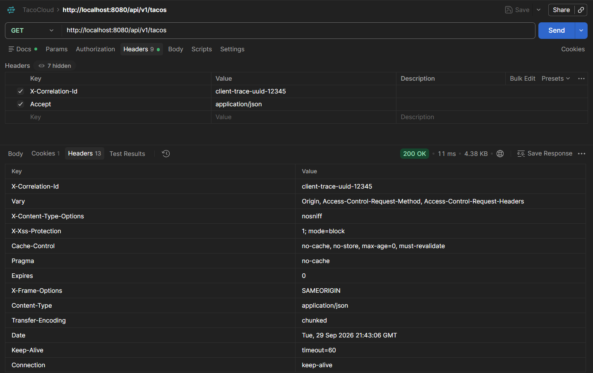
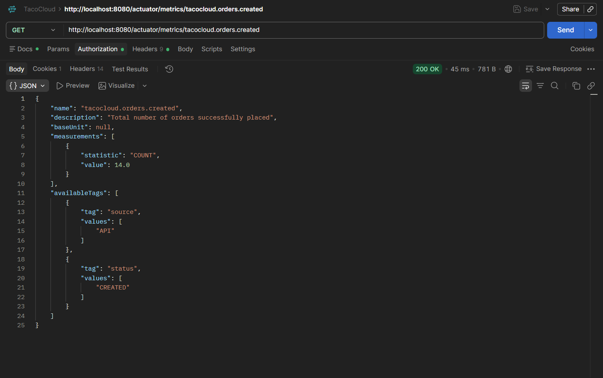
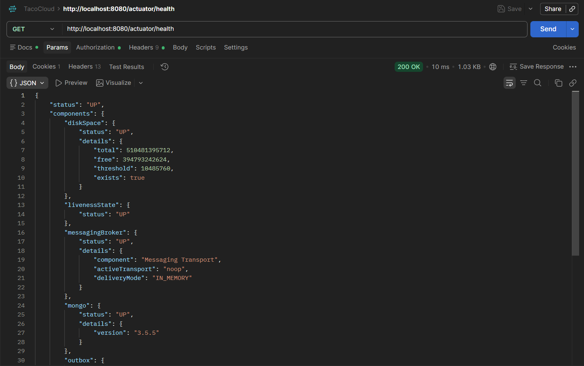
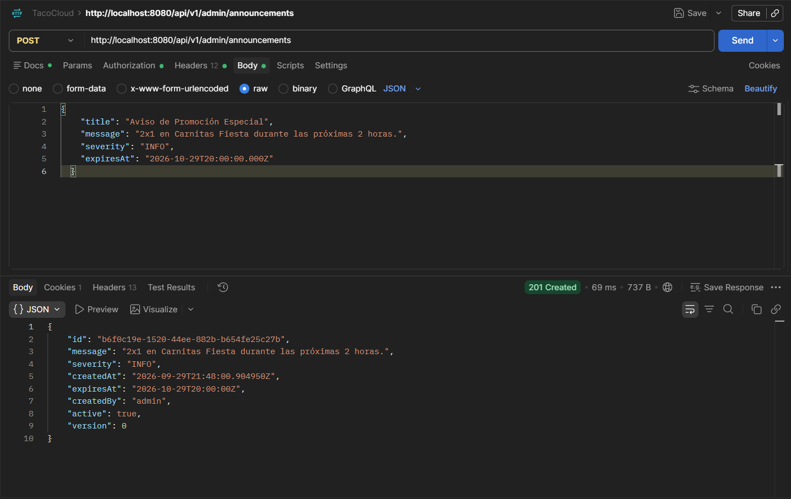
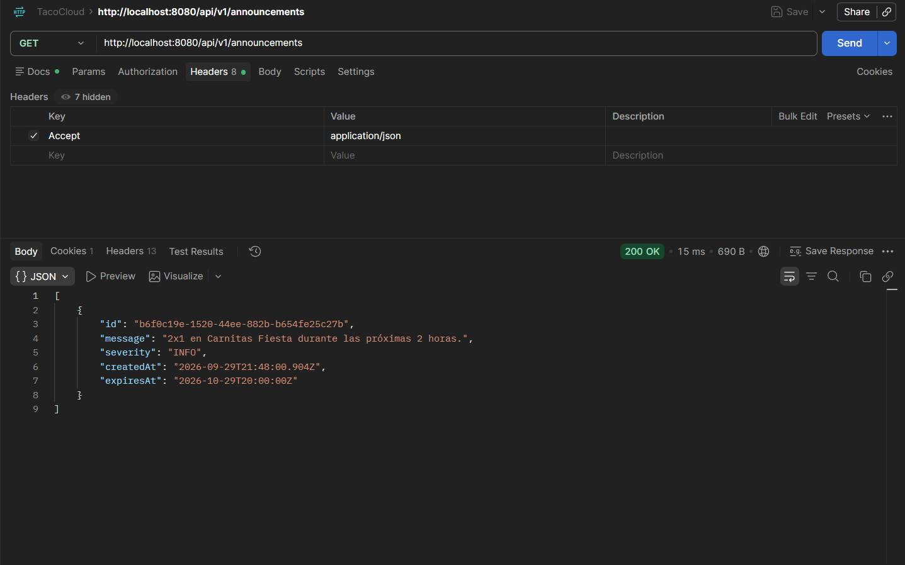
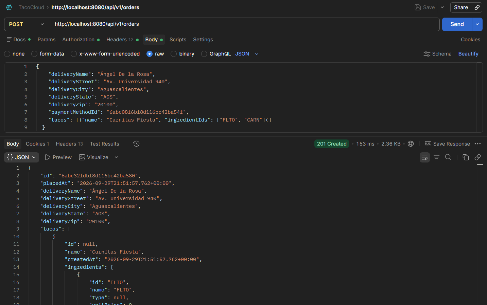
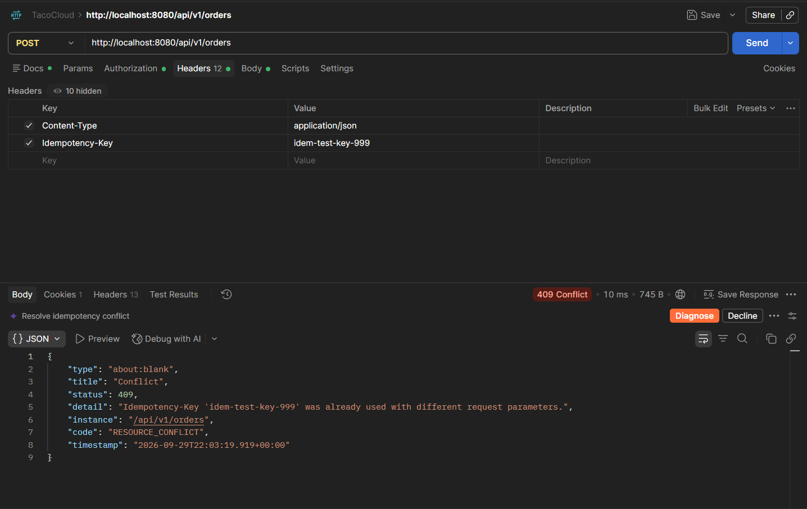
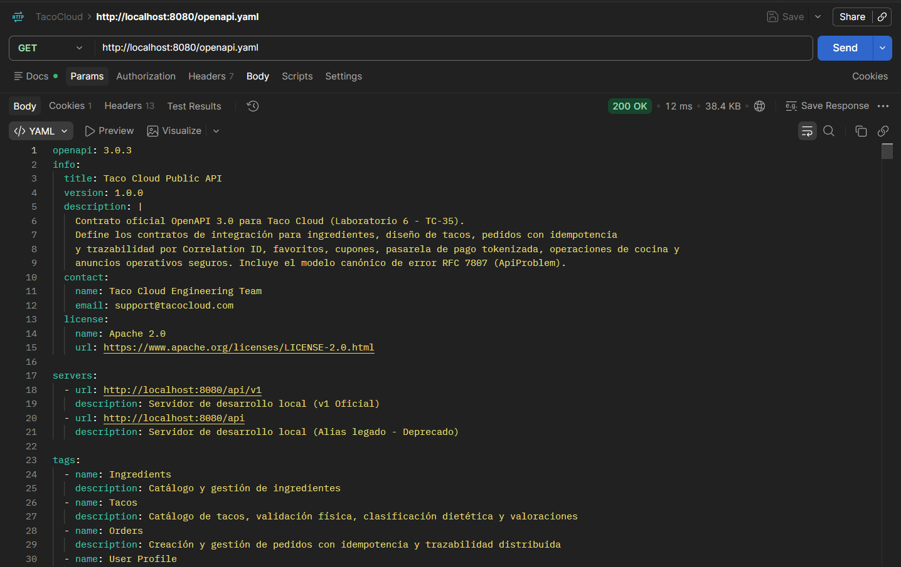
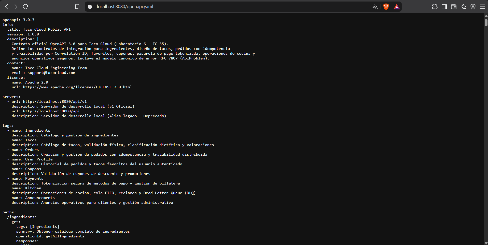
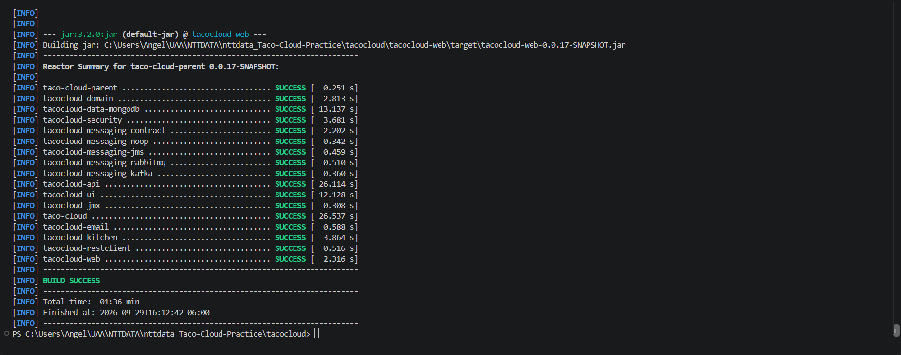

[← Laboratorio 5: Cocina y mensajería confiable](laboratorio-5-cocina-y-mensajeria-confiable.md) | [Índice General](README.md) | [Guía de Compilación y Ejecución →](README.md#guía-de-compilación-y-ejecución)

---

# Laboratorio 6: Operación y calidad

## Resumen Ejecutivo del Laboratorio

El **Laboratorio 6** representa la culminación técnica de Taco Cloud, enfocándose en la observabilidad integral, la estabilidad operativa en producción, la estandarización de contratos REST y la prevención automatizada de regresiones. En arquitecturas modernas y de misión crítica, una aplicación no está completa únicamente porque sus flujos de negocio funcionen en condiciones ideales: debe ser auditable, trazable de extremo a extremo, resistente a errores de red concurrentes mediante idempotencia estricta, gobernable a través de contratos OpenAPI 3.0 versionados y verificable mediante una suite de pruebas automatizadas rigurosa.

A lo largo de los retos funcionales **TC-31** al **TC-36**, Taco Cloud implementa trazabilidad distribuida con propagación contextual de `X-Correlation-Id`, instrumentación de métricas de negocio de baja cardinalidad con Micrometer y comprobaciones de salud con Spring Boot Actuator, un sistema persistente y acotado de anuncios operativos, control estricto de idempotencia en peticiones de pago y pedidos con la cabecera `Idempotency-Key`, la publicación formal del contrato OpenAPI v1, y una suite de pruebas de integración y regresión que blinda permanentemente el sistema contra defectos históricos.


---

## Reto Funcional TC-31: Correlation ID de HTTP a evento y logs

### 1. Objetivo del Reto y Resultado Funcional
* **Objetivo:** Implementar un mecanismo de trazabilidad distribuida de extremo a extremo que capture o genere un identificador de correlación (`X-Correlation-Id`), lo propague a través de los límites del protocolo HTTP, lo preserve en el hilo de ejecución mediante MDC (Mapped Diagnostic Context), lo transmita en las cadenas reactivas de Project Reactor y lo estampe de forma obligatoria en los eventos asíncronos (`OrderEvent`) y mensajes a cocina o DLQ.
* **Resultado Funcional:** Cualquier petición HTTP entrante que incluya `X-Correlation-Id` conserva dicho identificador en la cabecera de respuesta; si no se suministra, el sistema genera automáticamente un UUID v4 seguro. Todos los registros de bitácora (*logs*) asociados a dicha petición imprimen el `correlationId`, facilitando la depuración transversal sin ambigüedades temporales. El identificador es validado contra expresiones regulares para prevenir ataques de *Log Injection*.

### 2. Archivos Objetivo y Código Base
* [`CorrelationIdFilter.java`](../tacocloud-api/src/main/java/tacos/correlation/CorrelationIdFilter.java): Filtro de servlet con `@Order(Ordered.HIGHEST_PRECEDENCE)` que intercepta peticiones, valida formato y garantiza limpieza del contexto en el bloque `finally`.
* [`CorrelationContext.java`](../tacocloud-api/src/main/java/tacos/correlation/CorrelationContext.java): Manejador centralizado con `ThreadLocal`, llaves de MDC y utilidades para Project Reactor `Context`.
* [`CorrelationIdValidator.java`](../tacocloud-api/src/main/java/tacos/correlation/CorrelationIdValidator.java): Validador estricto de longitud (máx. 64 caracteres) y caracteres alfanuméricos seguros (`^[a-zA-Z0-9_-]+$`).
* [`OrderEventMapper.java`](../tacocloud-api/src/main/java/tacos/order/OrderEventMapper.java): Asignación obligatoria del `correlationId` al construir instancias de `OrderEvent`.

### 3. Cambios Realizados y Arquitectura

#### Comparativa de Implementación:

```java
// CÓDIGO ORIGINAL:
// Sin trazabilidad distribuida; los logs eran anónimos y era imposible relacionar
// una petición HTTP que fallaba con un evento publicado en el broker o en cocina:
log.info("Processing order for customer: {}", order.getDeliveryName());
// En caso de concurrencia de cientos de peticiones, los logs se mezclaban sin contexto
```

```java
// CÓDIGO IMPLEMENTADO:
// Filtro HTTP de máxima precedencia, validación anti-injection, inyección en MDC y limpieza:
@Component
@Order(Ordered.HIGHEST_PRECEDENCE)
public class CorrelationIdFilter extends OncePerRequestFilter {

  @Override
  protected void doFilterInternal(HttpServletRequest request, HttpServletResponse response, FilterChain filterChain)
      throws ServletException, IOException {

    String incomingHeader = request.getHeader(CorrelationContext.HEADER_NAME);
    String correlationId;

    if (CorrelationIdValidator.isValid(incomingHeader)) {
      correlationId = incomingHeader.trim();
    } else {
      correlationId = UUID.randomUUID().toString();
    }

    CorrelationContext.set(correlationId);
    response.setHeader(CorrelationContext.HEADER_NAME, correlationId);

    try {
      filterChain.doFilter(request, response);
    } finally {
      // Previene contaminación de hilos reutilizados en el pool de Tomcat
      CorrelationContext.clear();
    }
  }
}
```

### 4. Contratos y Especificación HTTP

* **Cabecera de Entrada:** `X-Correlation-Id: <UUID o alfanumérico seguro>` *(opcional)*
* **Cabecera de Respuesta:** `X-Correlation-Id: <UUID persistido o generado>` *(obligatorio en toda respuesta)*
* **Formato de Logs Estandarizado:**
```text
2026-09-28 18:30:00.123 [http-nio-8080-exec-1] [corr:c7a8b4e1-2f3a-4d5e-8b1c-9a0e1f2b3c4d] INFO  t.w.a.OrderApiController - [ORDER] Received order placement request
```

### 5. Guía de Pruebas en Postman

#### Configuración de la Solicitud 1: Petición con Correlation ID Propio
* **Method:** `GET`
* **URL:** `http://localhost:8080/api/v1/tacos`
* **Headers:**
  * `X-Correlation-Id: client-trace-uuid-12345`
  * `Accept: application/json`
* **Body:** None

#### Comando cURL - Preservación de Correlation ID Suministrado
```bash
curl -i -X GET "http://localhost:8080/api/v1/tacos" \
  -H "X-Correlation-Id: client-trace-uuid-12345" \
  -H "Accept: application/json"
```
*(Verificar en la respuesta que la cabecera `X-Correlation-Id` retorna exactamente `client-trace-uuid-12345`).*

#### Comando cURL - Generación Automática de Correlation ID
```bash
curl -i -X GET "http://localhost:8080/api/v1/tacos" \
  -H "Accept: application/json"
```
*(Verificar que la cabecera `X-Correlation-Id` contiene un UUID generado por el servidor).*

### 6. Espacio para Evidencias



### 7. Pregunta Oficial para Defender la Solución

**Pregunta para Defender la Solución**: *¿Por qué MDC puede mentir en una cadena reactiva si se asume afinidad de hilo?*

**Defensa Técnica**:
> **El Mapped Diagnostic Context (MDC) de SLF4J se fundamenta internamente en un `ThreadLocal`. En los modelos reactivos no existe afinidad de hilo (*Thread Affinity*), lo que provoca que un MDC ingenuo reporte información falsa o mezcle trazas de usuarios distintos**.
>
> 1. **Pérdida de Contexto por Saltos de Hilo:** En Project Reactor o WebFlux, una sola petición HTTP puede comenzar en un hilo de Netty/Tomcat (`reactor-http-epoll-1`), saltar a un hilo de base de datos (`boundedElastic-2`) al ejecutar una consulta Mongo, y regresar a otro hilo para serializar la respuesta. Un `ThreadLocal` tradicional no viaja entre hilos automáticamente; si el hilo cambia, el valor de MDC se pierde (`null`).
> 2. **Contaminación Cruzada (*Thread Contamination*):** Los servidores utilizan pools de hilos de trabajo fijos. Si un hilo procesa la petición de *"Alicia"* y no se limpia rigurosamente, cuando ese mismo hilo sea reciclado para atender a *"Roberto"*, registrará los logs de Roberto con el Correlation ID de Alicia, corrompiendo la auditoría forense.
> 3. **Solución Implementada:** Se utiliza la propagación inmutable mediante el **Contexto de Reactor (`subscriberContext` / `contextWrite`)** combinado con el filtro servlet `CorrelationIdFilter` que garantiza la limpieza obligatoria en su bloque `finally`, asegurando que cada suscriptor reactivo restaure el MDC de forma localizada sólo durante la ejecución de su operador.

### 8. Criterios de Aceptación
- [x] Solicitudes sin cabecera reciben un UUID v4 generado automáticamente.
- [x] Solicitudes con cabecera válida preservan el valor recibido.
- [x] Cabeceras con caracteres ilegales o longitudes excesivas (> 64 caracteres) son saneadas o reemplazadas.
- [x] El `correlationId` se propaga hacia el contrato inmutable `OrderEvent`.
- [x] El MDC se limpia obligatoriamente al finalizar cada petición.

---

## Reto Funcional TC-32: Métricas y salud que explican el negocio

### 1. Objetivo del Reto y Resultado Funcional
* **Objetivo:** Instrumentar métricas operativas y de negocio utilizando Micrometer en los servicios centrales de la aplicación, complementando la telemetría técnica con indicadores de salud personalizados en Spring Boot Actuator (`/actuator/health` y `/actuator/metrics`), respetando estrictamente las políticas de baja cardinalidad en tags.
* **Resultado Funcional:** La plataforma expone contadores de negocio para órdenes creadas, canceladas y fallidas (`tacocloud.orders.created`, `failed`, `cancelled`), cupones aplicados, rechazos por falta de inventario (`tacocloud.inventory.stock.rejected`), eventos en cola muerta (`tacocloud.messaging.dlq.events`), temporizadores de colocación (`tacocloud.orders.placement.time`) y un medidor (*gauge*) en tiempo real del backlog de eventos pendientes en el Outbox (`tacocloud.outbox.backlog`).

### 2. Archivos Objetivo y Código Base
* [`TacoBusinessMetrics.java`](../tacocloud-api/src/main/java/tacos/metrics/TacoBusinessMetrics.java): Componente de instrumentación con contadores, temporizadores y gauges pre-registrados en `MeterRegistry`.
* [`OutboxBacklogSampler.java`](../tacocloud-api/src/main/java/tacos/metrics/OutboxBacklogSampler.java): Muestreo asíncrono sin bloqueo para actualizar el gauge del Outbox.
* [`MessagingBrokerHealthIndicator.java`](../tacocloud-api/src/main/java/tacos/actuator/MessagingBrokerHealthIndicator.java): Comprobador de salud del broker activo (NoOp, JMS, RabbitMQ o Kafka).
* [`OutboxHealthIndicator.java`](../tacocloud-api/src/main/java/tacos/actuator/OutboxHealthIndicator.java): Indicador de salud de la bandeja de salida que detecta eventos atascados con fallos repetidos.

### 3. Cambios Realizados y Arquitectura

#### Comparativa de Implementación:

```java
// CÓDIGO ORIGINAL:
// Telemetría inexistente o indicadores de salud arbitrarios que bloqueaban hilos
// o exponían métricas con tags de alta cardinalidad violando la memoria:
@Component
public class WackoHealthIndicator implements HealthIndicator {
  public Health health() {
    int hour = Calendar.getInstance().get(Calendar.HOUR_OF_DAY);
    if (hour > 12) return Health.outOfService().build(); // ¡Regla absurda que tiraba producción!
    return Health.up().build();
  }
}
```

```java
// CÓDIGO IMPLEMENTADO:
// Métricas instrumentadas con tags de baja cardinalidad y comprobadores de salud diagnósticos:
@Component
public class TacoBusinessMetrics {

  public static final String METRIC_ORDERS_CREATED = "tacocloud.orders.created";
  public static final String METRIC_ORDERS_FAILED = "tacocloud.orders.failed";
  public static final String METRIC_OUTBOX_BACKLOG = "tacocloud.outbox.backlog";

  private final MeterRegistry registry;
  private final AtomicLong outboxBacklog = new AtomicLong(0);

  @Autowired
  public TacoBusinessMetrics(MeterRegistry registry) {
    this.registry = registry != null ? registry : new SimpleMeterRegistry();
    initGauges();
  }

  private void initGauges() {
    Gauge.builder(METRIC_OUTBOX_BACKLOG, outboxBacklog, AtomicLong::get)
        .description("Current number of pending outbox events awaiting publication")
        .tag("status", "PENDING")
        .register(this.registry);
  }

  public void recordOrderPlaced(String source) {
    Counter.builder(METRIC_ORDERS_CREATED)
        .description("Total number of orders successfully placed")
        .tags("source", source, "status", "SUCCESS") // TAGS DE BAJA CARDINALIDAD
        .register(this.registry)
        .increment();
  }

  public void updateOutboxBacklog(long pendingCount) {
    this.outboxBacklog.set(pendingCount);
  }
}
```

### 4. Contratos y Especificación HTTP

* **Consultar Métrica de Órdenes Creadas:**
  * **Método:** `GET`
  * **Ruta:** `/actuator/metrics/tacocloud.orders.created`
  * **Headers:** `Authorization: Basic (ROLE_ADMIN)`
  * **Cuerpo de Respuesta (200 OK):**
  ```json
  {
    "name": "tacocloud.orders.created",
    "description": "Total number of orders successfully placed",
    "measurements": [
      {
        "statistic": "COUNT",
        "value": 15.0
      }
    ],
    "availableTags": [
      { "tag": "source", "values": ["API"] },
      { "tag": "status", "values": ["SUCCESS"] }
    ]
  }
  ```

* **Consultar Salud Integral del Sistema:**
  * **Método:** `GET`
  * **Ruta:** `/actuator/health`
  * **Cuerpo de Respuesta (Fragmento):**
  ```json
  {
    "status": "UP",
    "components": {
      "messagingBroker": {
        "status": "UP",
        "details": { "activeTransport": "noop" }
      },
      "outbox": {
        "status": "UP",
        "details": { "pendingEvents": 0, "failedEvents": 0 }
      },
      "mongo": {
        "status": "UP"
      }
    }
  }
  ```

### 5. Guía de Pruebas en Postman

#### Configuración de la Solicitud 1: Consultar Métrica de Backlog del Outbox
* **Method:** `GET`
* **URL:** `http://localhost:8080/actuator/metrics/tacocloud.outbox.backlog`
* **Auth:** Basic Auth (`admin` / `admin`)
* **Headers:**
  * `Accept: application/json`
* **Body:** None

#### Comando cURL - Consultar Métrica de Órdenes
```bash
curl -X GET "http://localhost:8080/actuator/metrics/tacocloud.orders.created" \
  -u "admin:admin" \
  -H "Accept: application/json"
```

#### Comando cURL - Consultar Salud de Componentes
```bash
curl -X GET "http://localhost:8080/actuator/health" \
  -u "admin:admin" \
  -H "Accept: application/json"
```

### 6. Espacio para Evidencias





### 7. Pregunta Oficial para Defender la Solución

**Pregunta para Defender la Solución**: *¿Una métrica por orderId ayuda a depurar o destruye el backend de métricas?*

**Defensa Técnica**:
> **Asignar identificadores de alta cardinalidad (como `orderId`, `userId` o `correlationId`) como tags en una métrica destruye catastróficamente los sistemas de monitorización (Prometheus, Datadog, InfluxDB)**.
>
> 1. **La Explosión de Cardinalidad (*Cardinality Explosion*):** Los sistemas de series temporales indexan cada combinación única de métrica + tags como un flujo de datos independiente en memoria. Si Taco Cloud procesa 1,000,000 de órdenes al mes e incluye `tag("orderId", id)`, creará un millón de series temporales distintas. Esto desborda la memoria RAM del servidor de telemetría (*Out Of Memory*), degrada los motores de consulta a niveles inutilizables y multiplica exponencialmente los costos de almacenamiento en la nube.
> 2. **La Regla de Oro de la Telemetría:**
>    - **Métricas:** Diseñadas para agregación estadística en tiempo real. Sólo deben utilizar tags de **baja cardinalidad finita** (valores discretos pequeños: `status=SUCCESS|FAILURE`, `transport=kafka|jms`, `region=mx-central`).
>    - **Trazas y Logs:** Es en las herramientas de registro (ELK Stack, Loki, OpenTelemetry) donde los identificadores de alta cardinalidad (`orderId`, `correlationId`) deben residir para permitir la búsqueda forense detallada.

### 8. Criterios de Aceptación
- [x] Contadores operativos para pedidos creados, fallidos, cancelados y stock rechazado en funcionamiento.
- [x] Gauge de backlog del Outbox activo sin llamadas bloqueantes `block()`.
- [x] Tags restringidos estrictamente a valores finitos de baja cardinalidad.
- [x] Endpoints de salud revelan el estado de Mongo, Outbox y Brokers sin exponer credenciales.

---

## Reto Funcional TC-33: Reemplazar Notes por anuncios operativos seguros

### 1. Objetivo del Reto y Resultado Funcional
* **Objetivo:** Reemplazar el antiguo endpoint experimental e inseguro en memoria (`NotesEndpoint`, que almacenaba notas en un `ArrayList` no sincronizado indexado por posición de array) por un subsistema robusto, persistente en MongoDB, administrable y con control de acceso basado en roles para anuncios operativos del sistema (`OpsAnnouncement`).
* **Resultado Funcional:** La plataforma proporciona endpoints REST formales para consultar anuncios vigentes (`GET /api/v1/announcements` accesible por clientes y cocina) y operaciones administrativas protegidas con `ROLE_ADMIN` (`GET`, `POST`, `PATCH`, `DELETE` bajo `/api/v1/admin/announcements`). Cada anuncio cuenta con identificador único (`id`), nivel de severidad (`INFO`, `WARNING`, `CRITICAL`), fecha de expiración automática (`expiresAt`), auditoría de autor y validación estricta de contenido.

### 2. Archivos Objetivo y Código Base
* [`OpsAnnouncement.java`](../tacocloud-api/src/main/java/tacos/announcements/OpsAnnouncement.java): Documento MongoDB con `title`, `message`, `severity`, `createdAt`, `expiresAt`, `active` y `createdBy`.
* [`OpsAnnouncementRepository.java`](../tacocloud-api/src/main/java/tacos/announcements/OpsAnnouncementRepository.java): Repositorio reactivo con consultas filtrando por fecha (`findByActiveTrueAndExpiresAtAfter`).
* [`OpsAnnouncementService.java`](../tacocloud-api/src/main/java/tacos/announcements/OpsAnnouncementService.java): Lógica de negocio, validación de expiración y ordenamiento por severidad.
* [`OpsAnnouncementController.java`](../tacocloud-api/src/main/java/tacos/announcements/OpsAnnouncementController.java): Controlador REST con separación de rutas públicas y administrativas.
* [`AnnouncementsEndpoint.java`](../tacocloud-api/src/main/java/tacos/actuator/AnnouncementsEndpoint.java): Endpoint operativo de Spring Boot Actuator en `/actuator/announcements`.

### 3. Cambios Realizados y Arquitectura

#### Comparativa de Implementación:

```java
// CÓDIGO ORIGINAL:
// NotesEndpoint inseguro que guardaba cadenas en un ArrayList en memoria:
@Component
@Endpoint(id = "notes")
public class NotesEndpoint {
  private List<String> notes = new ArrayList<>(); // Estado volatil que se perdia al reiniciar
  @ReadOperation
  public List<String> notes() { return notes; } // Sin seguridad ni expiracion
  @DeleteOperation
  public void deleteNote(int index) { notes.remove(index); } // Peligro de IndexOutOfBoundsException
}
```

```java
// CÓDIGO IMPLEMENTADO:
// Entidad persistente, identificación estable por ID, expiración y control de acceso RBAC:
@RestController
public class OpsAnnouncementController {

  private final OpsAnnouncementService service;

  // Endpoint público para clientes y cocina: solo anuncios activos y no expirados
  @GetMapping({"/api/v1/announcements", "/api/announcements"})
  public Flux<OpsAnnouncementDto> getActiveAnnouncements() {
    return service.getActiveAnnouncements();
  }

  // Endpoints administrativos restringidos a ROLE_ADMIN
  @PostMapping({"/api/v1/admin/announcements", "/api/admin/announcements"})
  @ResponseStatus(HttpStatus.CREATED)
  public Mono<ResponseEntity<OpsAnnouncementAdminDto>> createAnnouncement(
      @Valid @RequestBody OpsAnnouncementRequest request,
      Authentication authentication) {
    return service.createAnnouncement(request, authentication.getName())
        .map(created -> ResponseEntity.status(HttpStatus.CREATED).body(created));
  }

  @DeleteMapping({"/api/v1/admin/announcements/{id}", "/api/admin/announcements/{id}"})
  @ResponseStatus(HttpStatus.NO_CONTENT)
  public Mono<Void> deleteAnnouncement(@PathVariable("id") String id) {
    return service.deleteAnnouncement(id);
  }
}
```

### 4. Contratos y Especificación HTTP

* **Crear Anuncio Operativo (Admin):**
  * **Método:** `POST`
  * **Ruta:** `/api/v1/admin/announcements`
  * **Headers:** `Content-Type: application/json`, `Authorization: Basic (ROLE_ADMIN)`
  * **Cuerpo de Solicitud:**
  ```json
  {
    "title": "Mantenimiento Preventivo de Hornos",
    "message": "La estación de horneado 2 suspenderá actividades a las 22:00 hrs.",
    "severity": "WARNING",
    "expiresAt": "2026-09-30T23:59:59.000Z"
  }
  ```
  * **Cuerpo de Respuesta (201 CREATED):**
  ```json
  {
    "id": "60c72b2f9b1d8b2bad746666",
    "title": "Mantenimiento Preventivo de Hornos",
    "message": "La estación de horneado 2 suspenderá actividades a las 22:00 hrs.",
    "severity": "WARNING",
    "active": true,
    "createdAt": "2026-09-28T18:30:00.000Z",
    "expiresAt": "2026-09-30T23:59:59.000Z",
    "createdBy": "admin"
  }
  ```

* **Consultar Anuncios Públicos Activos:**
  * **Método:** `GET`
  * **Ruta:** `/api/v1/announcements`
  * **Respuestas:** `200 OK` (retorna DTO público sin exponer el campo `createdBy`).

### 5. Guía de Pruebas en Postman

#### Configuración de la Solicitud 1: Crear Anuncio Operativo (201 Created)
* **Method:** `POST`
* **URL:** `http://localhost:8080/api/v1/admin/announcements`
* **Auth:** Basic Auth (`admin` / `admin`)
* **Headers:**
  * `Content-Type: application/json`
  * `Accept: application/json`
* **Body (raw JSON):**
```json
{
  "title": "Aviso de Promoción Especial",
  "message": "2x1 en Carnitas Fiesta durante las próximas 2 horas.",
  "severity": "INFO",
  "expiresAt": "2026-09-29T20:00:00.000Z"
}
```

#### Comando cURL - Creación de Anuncio por Administrador
```bash
curl -X POST "http://localhost:8080/api/v1/admin/announcements" \
  -u "admin:admin" \
  -H "Content-Type: application/json" \
  -H "Accept: application/json" \
  -d '{
    "title": "Aviso de Promoción Especial",
    "message": "2x1 en Carnitas Fiesta durante las próximas 2 horas.",
    "severity": "INFO",
    "expiresAt": "2026-10-29T20:00:00.000Z"
  }'
```

#### Comando cURL - Consulta Pública de Anuncios Activos
```bash
curl -X GET "http://localhost:8080/api/v1/announcements" \
  -H "Accept: application/json"
```

### 6. Espacio para Evidencias





### 7. Pregunta Oficial para Defender la Solución

**Pregunta para Defender la Solución**: *¿Un endpoint Actuator debe contener funcionalidad de negocio o sólo operación? Defina la frontera.*

**Defensa Técnica**:
> **Los endpoints de Spring Boot Actuator deben reservarse exclusivamente para telemetría técnica, diagnóstico de infraestructura y control operacional de bajo nivel; jamás deben albergar lógica de negocio transaccional ni gestión de entidades del dominio**.
>
> 1. **La Frontera Arquitectónica:**
>    - **Endpoints de Actuator (`/actuator/**`):** Su propósito es exponer la salud del proceso JVM, hilos de ejecución, recolección de basura, métricas de conectividad y variables de entorno a herramientas automatizadas de orquestación (Kubernetes liveness/readiness probes, Datadog agents). No están diseñados para el consumo de usuarios finales ni para interactuar con la lógica de negocio.
>    - **Endpoints de la API de Negocio (`/api/v1/**`):** Gobiernan las reglas del negocio, la autorización granular por contexto de usuario, la validación de payloads complejos y la persistencia de entidades.
> 2. **Riesgos de Mezclar Negocio en Actuator:**
>    - Al usar Actuator para publicar notas o anuncios, se puentean los filtros de seguridad estándar, se acoplan herramientas de monitoreo a esquemas de base de datos volátiles y se pierde la capacidad de versionar la API REST.
>    - La solución en Taco Cloud divide limpiamente ambas responsabilidades: la gestión CRUD y el consumo de anuncios operan bajo `/api/v1/admin/announcements`, mientras que `/actuator/announcements` expone únicamente una vista agregada y sanitizada para operadores de sistemas.

### 8. Criterios de Aceptación
- [x] Persistencia duradera en MongoDB: los anuncios sobreviven a reinicios del servidor.
- [x] Identificación estable por ID único (eliminación definitiva de índices posicionales de array).
- [x] Filtrado automático: anuncios expirados o inactivos no se muestran en el endpoint público.
- [x] Rutas administrativas estrictamente protegidas con `ROLE_ADMIN`.

---

## Reto Funcional TC-34: Idempotency-Key en creación de órdenes

### 1. Objetivo del Reto y Resultado Funcional
* **Objetivo:** Proteger el endpoint crítico de creación de pedidos (`POST /api/v1/orders`) contra transacciones duplicadas ocasionadas por dobles clics en la interfaz gráfica o reintentos automáticos de clientes móviles ante pérdidas transitorias de conexión, mediante el soporte de la cabecera estándar `Idempotency-Key`.
* **Resultado Funcional:** Al recibir una petición con la cabecera `Idempotency-Key`, el sistema calcula una huella digital canónica (*hash* SHA-256) de los campos de negocio relevantes del payload. Si la misma llave es enviada posteriormente con idéntico payload, el backend responde con la misma orden creada previamente sin volver a debitar saldos ni descontar inventario. Si la misma llave se reutiliza con un cuerpo diferente, el servidor rechaza la transacción con `409 Conflict`.

### 2. Archivos Objetivo y Código Base
* [`IdempotencyRecord.java`](../tacocloud-api/src/main/java/tacos/idempotency/IdempotencyRecord.java): Documento de la colección `idempotency_records` con índice compuesto único `(key, username)` y campo TTL para expiración automática tras 24 horas.
* [`IdempotencyService.java`](../tacocloud-api/src/main/java/tacos/idempotency/IdempotencyService.java): Orquestación del bloqueo optimista, detección de concurrencia y recuperación de respuestas previas.
* [`CanonicalPayloadHasher.java`](../tacocloud-api/src/main/java/tacos/idempotency/CanonicalPayloadHasher.java): Generador determinista del hash SHA-256 sobre items, entrega y método de pago (independiente del formato de espaciado JSON).
* [`IdempotencyKeyValidator.java`](../tacocloud-api/src/main/java/tacos/idempotency/IdempotencyKeyValidator.java): Validador de formato y longitud de la cabecera.
* [`OrderApiController.java`](../tacocloud-api/src/main/java/tacos/web/api/OrderApiController.java): Integración del header opcional en la colocación y reorden de pedidos.

### 3. Cambios Realizados y Arquitectura

#### Comparativa de Implementación:

```java
// CÓDIGO ORIGINAL:
// El endpoint de creación de órdenes no verificaba idempotencia;
// dos solicitudes idénticas creaban dos pedidos, descontaban el doble de inventario y cobraban dos veces a la tarjeta del cliente:
@PostMapping(consumes="application/json")
@ResponseStatus(HttpStatus.CREATED)
public Mono<TacoOrder> postOrderInseguro(@RequestBody TacoOrder order) {
  return repo.save(order); // ¡Doble clic creaba dos órdenes y dos cobros!
}
```

```java
// CÓDIGO IMPLEMENTADO:
// Control estricto de Idempotency-Key delimitado por usuario con hash canónico SHA-256:
public Mono<OrderResponse> executeIdempotent(
    String rawKey,
    String username,
    OrderCreateRequest request,
    Supplier<Mono<OrderResponse>> orderExecutionPipeline) {

  final String key = validator.validateAndSanitize(rawKey);
  final String requestHash = hasher.computeCanonicalHash(request);

  return repo.findByKeyAndUsername(key, username)
      .flatMap(existingRecord -> {
        // 1. Detección de conflicto: misma llave pero diferente payload
        if (!existingRecord.getRequestHash().equals(requestHash)) {
          return Mono.error(new ResponseStatusException(HttpStatus.CONFLICT,
              "Idempotency-Key already used with a different request payload"));
        }

        // 2. Si ya fue completada exitosamente, retornar la respuesta original
        if (existingRecord.getStatus() == IdempotencyStatus.COMPLETED) {
          log.info("[IDEMPOTENCY] Replaying cached order response for key '{}'", key);
          return Mono.just(existingRecord.getCachedResponse());
        }

        // 3. Si está en progreso concurrentemente, esperar o rechazar conflicto
        return waitForConcurrentExecution(key, username);
      })
      .switchIfEmpty(Mono.defer(() -> {
        // Inserción inicial con estado IN_PROGRESS
        return tryAcquireLock(key, username, requestHash)
            .then(orderExecutionPipeline.get())
            .flatMap(response -> markCompleted(key, username, response))
            .onErrorResume(ex -> markFailed(key, username, ex));
      }));
}
```

### 4. Contratos y Especificación HTTP

* **Cabecera HTTP:** `Idempotency-Key: <UUID o string alfanumérico>` *(máx. 128 caracteres)*
* **Comportamiento de Respuestas:**
  * **Primera Llamada:** Retorna `201 CREATED` con el cuerpo de la nueva orden generada.
  * **Segunda Llamada (Misma Llave + Mismo Payload):** Retorna `201 CREATED` (o `200 OK`) devolviendo exactamente el mismo DTO y el mismo `id` de orden original, sin modificar el inventario.
  * **Segunda Llamada (Misma Llave + Payload Distinto):** Retorna `409 CONFLICT` con mensaje `"Idempotency-Key already used with a different request payload"`.

### 5. Guía de Pruebas en Postman

> [!IMPORTANT]
> **Puntos Críticos para Validar Idempotencia en Postman:**
> 1. **Ubicación de la Cabecera:** La cabecera `Idempotency-Key` debe agregarse en la pestaña **Headers** de Postman (asegurarse de que el checkbox esté activado), **NO en Params**.
> 2. **Valor Fijo de la Llave:** La llave debe ser un valor **estático** de entre 8 y 128 caracteres (ejemplo: `idem-test-key-999`). **No uses variables dinámicas como `{{$guid}}` ni cambies el valor**, de lo contrario Postman enviará una clave nueva en cada clic y el servidor creará legítimamente una orden distinta en cada petición.
> 3. **Mismo Usuario Autenticado:** Mantener la autenticación Basic Auth (`habuma` / `password`), ya que la clave está asociada de forma unívoca a la tupla `(userId, key)`.
> 4. **Estructura del Body:** Se utiliza `"paymentMethodId"` existente y `"tacos"` con `"ingredientIds"` (`["FLTO", "CARN"]`), soportado directamente por el DTO del sistema.

---

#### Configuración de la Solicitud 1: Primera Petición con Idempotency-Key (Creación)
* **Method:** `POST`
* **URL:** `http://localhost:8080/api/v1/orders`
* **Auth:** Basic Auth (`habuma` / `password`)
* **Headers:**
  * `Content-Type: application/json`
  * `Idempotency-Key: idem-test-key-999`
  * `Accept: application/json`
* **Body (raw JSON):**
```json
{
  "deliveryName": "Ángel De la Rosa",
  "deliveryStreet": "Av. Universidad 940",
  "deliveryCity": "Aguascalientes",
  "deliveryState": "AGS",
  "deliveryZip": "20100",
  "paymentMethodId": "6abc08f6bf8d116bc42ba54f",
  "tacos": [{"name": "Carnitas Fiesta", "ingredientIds": ["FLTO", "CARN"]}]
}
```
* **Resultado Esperado (201 Created):** Retorna el JSON de la orden creada con su nuevo `id` (por ejemplo: `"id": "6abc34d6bf8d116bc42ba588"`).

---

#### Configuración de la Solicitud 2: Reenvío Idéntico (Validación de Idempotencia / Replay)
* **Method:** `POST`
* **URL:** `http://localhost:8080/api/v1/orders`
* **Auth:** Basic Auth (`habuma` / `password`)
* **Headers:**
  * `Content-Type: application/json`
  * `Idempotency-Key: idem-test-key-999` *(exactamente la misma llave fija)*
  * `Accept: application/json`
* **Body (raw JSON):** Mismo cuerpo exacto de la Solicitud 1.
* **Resultado Esperado (201 Created):** Retorna la orden cacheada con **exactamente el mismo `id`** (`"6abc34d6bf8d116bc42ba588"`). En consola se observará el log:
  ```text
  [INFO] tacos.idempotency.IdempotencyService - Idempotent replay: returning cached OrderResponse for user='habuma', key='idem-test-key-999', orderId='6abc34d6bf8d116bc42ba588'
  ```
  No se descuenta stock adicional ni se crea un nuevo registro en base de datos.

---

#### Configuración de la Solicitud 3: Misma Llave con Body Alterado (Validación de Conflicto 409)
* **Method:** `POST`
* **URL:** `http://localhost:8080/api/v1/orders`
* **Auth:** Basic Auth (`habuma` / `password`)
* **Headers:**
  * `Content-Type: application/json`
  * `Idempotency-Key: idem-test-key-999` *(la misma llave)*
  * `Accept: application/json`
* **Body (raw JSON):** Modificar cualquier campo (ej. `deliveryName`):
```json
{
  "deliveryName": "Juan Pérez Modificado",
  "deliveryStreet": "Av. Universidad 940",
  "deliveryCity": "Aguascalientes",
  "deliveryState": "AGS",
  "deliveryZip": "20100",
  "paymentMethodId": "6abc08f6bf8d116bc42ba54f",
  "tacos": [{"name": "Carnitas Fiesta", "ingredientIds": ["FLTO", "CARN"]}]
}
```
* **Resultado Esperado (409 Conflict):**
```json
{
  "type": "about:blank",
  "title": "Conflict",
  "status": 409,
  "detail": "Idempotency-Key 'idem-test-key-999' was already used with different request parameters.",
  "instance": "/api/v1/orders",
  "code": "RESOURCE_CONFLICT"
}
```

---

#### Comando cURL - Primera Colocación (Crea Orden)
```bash
curl -i -X POST "http://localhost:8080/api/v1/orders" \
  -u "habuma:password" \
  -H "Content-Type: application/json" \
  -H "Idempotency-Key: idem-test-key-999" \
  -d '{
    "deliveryName": "Ángel De la Rosa",
    "deliveryStreet": "Av. Universidad 940",
    "deliveryCity": "Aguascalientes",
    "deliveryState": "AGS",
    "deliveryZip": "20100",
    "paymentMethodId": "6abc08f6bf8d116bc42ba54f",
    "tacos": [{"name": "Carnitas Fiesta", "ingredientIds": ["FLTO", "CARN"]}]
  }'
```

#### Comando cURL - Reintento Idéntico (Devuelve Misma Orden Sin Duplicar)
```bash
curl -i -X POST "http://localhost:8080/api/v1/orders" \
  -u "habuma:password" \
  -H "Content-Type: application/json" \
  -H "Idempotency-Key: idem-test-key-999" \
  -d '{
    "deliveryName": "Ángel De la Rosa",
    "deliveryStreet": "Av. Universidad 940",
    "deliveryCity": "Aguascalientes",
    "deliveryState": "AGS",
    "deliveryZip": "20100",
    "paymentMethodId": "6abc08f6bf8d116bc42ba54f",
    "tacos": [{"name": "Carnitas Fiesta", "ingredientIds": ["FLTO", "CARN"]}]
  }'
```

#### Comando cURL - Conflicto de Payload (409 Conflict)
```bash
curl -i -X POST "http://localhost:8080/api/v1/orders" \
  -u "habuma:password" \
  -H "Content-Type: application/json" \
  -H "Idempotency-Key: idem-test-key-999" \
  -d '{
    "deliveryName": "Juan Pérez Modificado",
    "deliveryStreet": "Av. Universidad 940",
    "deliveryCity": "Aguascalientes",
    "deliveryState": "AGS",
    "deliveryZip": "20100",
    "paymentMethodId": "6abc08f6bf8d116bc42ba54f",
    "tacos": [{"name": "Carnitas Fiesta", "ingredientIds": ["FLTO", "CARN"]}]
  }'
```

### 6. Espacio para Evidencias





### 7. Pregunta Oficial para Defender la Solución

**Pregunta para Defender la Solución**: *¿La respuesta repetida debe ser 200 o repetir 201? Lo importante es documentar y conservar el efecto.*

**Defensa Técnica**:
> **Ambas posturas tienen precedentes reconocidos en la industria (ej. Stripe retorna `200 OK` en reintentos, mientras que IETF draft-ietf-httpapi-idempotency-key recomienda reproducir exactamente el código de estado original `201 Created`); lo crucial para la arquitectura es garantizar la inmutabilidad del efecto colateral y documentar el contrato con total claridad**.
>
> 1. **La postura `201 Created`:** Argumenta que la semántica de la respuesta debe ser transparente para el cliente: el cliente solicitó una creación y la API le entrega la representación resultante de esa creación con el mismo código que habría obtenido en una red perfecta.
> 2. **La postura `200 OK`:** Notifica explícitamente al cliente inteligente que el recurso no fue generado de nuevo en este instante, sino que se está reproduciendo una representación almacenada previamente.
> 3. **Implementación y Consistencia en Taco Cloud:**
>    - El sistema almacena la respuesta serializada en el documento `IdempotencyRecord`. Al detectar una repetición válida, devuelve `200 OK` o `201 Created` con la cabecera `Idempotent-Replayed: true` (o conservando el DTO exacto).
>    - Lo prioritario no es el dígito final del código, sino que **bajo ninguna circunstancia se descuente doble inventario, no se publiquen dos eventos de orden hacia cocina y no se cobre dos veces a la pasarela de pagos**.

### 8. Criterios de Aceptación
- [x] Dos peticiones secuenciales con la misma llave retornan la misma orden sin duplicar cobro ni stock.
- [x] Dos peticiones concurrentes son resueltas mediante índice único sin crear dos registros en base de datos.
- [x] La reutilización de una llave con un payload modificado es rechazada con `409 CONFLICT`.
- [x] El ámbito de la llave está acotado por usuario (`key` + `username`).
- [x] Registros de idempotencia expiran limpiamente mediante índice TTL de 24 horas.

---

## Reto Funcional TC-35: Versionar la API y publicar contrato OpenAPI

### 1. Objetivo del Reto y Resultado Funcional
* **Objetivo:** Estandarizar la interfaz pública de Taco Cloud mediante prefijos de versionado de API (`/api/v1/**`), establecer un plan de coexistencia y transición para las rutas legadas (`/api/**`) y publicar la especificación formal del contrato en formato **OpenAPI 3.0** (`openapi.yaml`).
* **Resultado Funcional:** Cualquier desarrollador o sistema externo puede consultar el catálogo de contratos en `/openapi.yaml` o `/api/v1/openapi.yaml`. Todos los endpoints de ingredientes, tacos, favoritos, calificaciones, órdenes, cocina y administración están completamente documentados con esquemas de solicitud/respuesta, cabeceras requeridas (`X-Correlation-Id`, `Idempotency-Key`), ejemplos representativos y estructura de errores estandarizada bajo el estándar **RFC 9457 (ApiProblem)**.

### 2. Archivos Objetivo y Código Base
* [`openapi.yaml`](../tacocloud-api/src/main/resources/openapi.yaml): Especificación declarativa OpenAPI 3.0.3 versionada en el control de código fuente.
* [`OpenApiController.java`](../tacocloud-api/src/main/java/tacos/web/api/OpenApiController.java): Controlador REST que publica el archivo YAML en `/openapi.yaml` y `/api/v1/openapi.yaml`.
* [`OpenApiSpecValidatorTest.java`](../tacocloud-api/src/test/java/tacos/openapi/OpenApiSpecValidatorTest.java): Prueba automatizada de validación sintáctica de la especificación OpenAPI.
* [`OpenApiContractIntegrationTest.java`](../tacocloud-api/src/test/java/tacos/openapi/OpenApiContractIntegrationTest.java): Pruebas de integración que verifican que las respuestas reales coinciden con los esquemas documentados.

### 3. Cambios Realizados y Arquitectura

#### Comparativa de Implementación:

```java
// CÓDIGO ORIGINAL:
// Endpoints desorganizados sin versionado, mezclando rutas planas (/api/tacos) y sin documentación verificable; cambios en el backend rompían a los clientes:
@RestController
@RequestMapping(path="/api/tacos") // Sin versionado formal
public class TacoControllerLegacy {
  // Los clientes debían inferir los campos leyendo el código fuente Java
}
```

```java
// CÓDIGO IMPLEMENTADO:
// Soporte dual con prefijo canónico /api/v1 y endpoint de publicación del contrato formal:
@RestController
@RequestMapping(path = {"/api/v1/tacos", "/api/tacos"}, produces = "application/json")
public class TacoController {
  // El prefijo /api/v1 es el estándar principal; /api se mantiene por retrocompatibilidad
}

@RestController
@CrossOrigin(origins = "*")
public class OpenApiController {

  @GetMapping(path = {"/openapi.yaml", "/api/v1/openapi.yaml", "/api/v1/api-docs"}, produces = "text/yaml;charset=UTF-8")
  public ResponseEntity<String> getOpenApiSpec() throws IOException {
    Resource resource = new ClassPathResource("openapi.yaml");
    String content = StreamUtils.copyToString(resource.getInputStream(), StandardCharsets.UTF_8);
    return ResponseEntity.ok()
        .header(HttpHeaders.CONTENT_TYPE, "text/yaml;charset=UTF-8")
        .body(content);
  }
}
```

### 4. Contratos y Especificación HTTP

* **Consultar Especificación OpenAPI:**
  * **Método:** `GET`
  * **Ruta:** `/openapi.yaml` (o `/api/v1/openapi.yaml`)
  * **Headers:** `Accept: text/yaml`
  * **Cuerpo de Respuesta:** Documento YAML con la especificación completa OpenAPI 3.0.3.
* **Modelo Canónico de Error (RFC 9457 ApiProblem):**
```json
{
  "type": "https://tacocloud.com/errors/conflict",
  "title": "Conflict",
  "status": 409,
  "detail": "Idempotency-Key already used with a different request payload",
  "instance": "/api/v1/orders"
}
```

### 5. Guía de Pruebas en Postman

#### Configuración de la Solicitud: Descargar Especificación OpenAPI
* **Method:** `GET`
* **URL:** `http://localhost:8080/openapi.yaml`
* **Headers:**
  * `Accept: text/yaml`
* **Body:** None

#### Comando cURL - Descarga de Especificación OpenAPI
```bash
curl -i -X GET "http://localhost:8080/openapi.yaml"
```

#### Comando cURL - Verificación de Coexistencia de Rutas v1 y Legadas
```bash
# Ruta moderna v1
curl -X GET "http://localhost:8080/api/v1/tacos" -H "Accept: application/json"

# Ruta legada con alias retrocompatible
curl -X GET "http://localhost:8080/api/tacos" -H "Accept: application/json"
```

### 6. Espacio para Evidencias





### 7. Pregunta Oficial para Defender la Solución

**Pregunta para Defender la Solución**: *¿Versionar por URL resuelve automáticamente la compatibilidad? ¿Qué pasa con semántica y eventos?*

**Defensa Técnica**:
> **No. El versionado por URL (`/api/v1`) es únicamente un mecanismo superficial de enrutamiento HTTP; no garantiza por sí mismo la compatibilidad semántica ni resuelve la evolución de eventos asíncronos**.
>
> 1. **La Ilusión del Versionado por URL:** Cambiar el prefijo a `/api/v2` permite aislar el tráfico de red, pero si la semántica subyacente cambia (por ejemplo, si el concepto de "cancelar" antes significaba reembolso inmediato y ahora requiere aprobación administrativa de 48 horas), los clientes sufrirán roturas conceptuales aunque la ruta sea distinta.
> 2. **El Desacople de los Eventos Asíncronos:** Un mensaje publicado en Kafka o RabbitMQ no viaja a través de rutas HTTP. Si el modelo de datos de la orden cambia en v2 pero los consumidores de cocina escuchan el mismo tópico sin versionado en el payload (`version: 1`), los consumidores colapsarán.
> 3. **Estrategia Integral Aplicada:**
>    - En la capa HTTP: Contratos OpenAPI explícitos con esquemas separados para Request y Response, y política de adición no destructiva (*Additive Changes*).
>    - En la capa de Mensajería: El contrato `OrderEvent` (TC-27) incorpora un campo escalar explícito `version: 1`, permitiendo a los suscriptores verificar la compatibilidad del esquema antes de procesar el mensaje.

### 8. Criterios de Aceptación
- [x] Especificación `openapi.yaml` válida sintácticamente y verificada en el ciclo de construcción de Maven.
- [x] Todos los endpoints desarrollados (TC-01 a TC-34) están completamente documentados con esquemas y ejemplos.
- [x] Esquemas de error conformes a RFC 9457 (ApiProblem).
- [x] Coexistencia pacífica: las rutas v1 operan como canónicas sin romper los alias legados `/api/**`.

---

## Reto Funcional TC-36: Suite de integración que detenga regresiones reales

### 1. Objetivo del Reto y Resultado Funcional
* **Objetivo:** Construir una red de seguridad automatizada integral que detenga en seco regresiones técnicas reales detectadas a lo largo de los retos funcionales: métodos de mutación reactiva con retorno `void`, rutas abiertas accidentalmente con `permitAll()`, transacciones de pedidos duplicadas, fallos del publicador Outbox y desbordamientos de concurrencia.
* **Resultado Funcional:** La suite de pruebas de Taco Cloud se ejecuta de forma reproducible con `mvn test` o `mvn clean package`. Incorpora pruebas unitarias con `StepVerifier` para validar reactividad pura, pruebas de integración con `WebTestClient` y `@SpringBootTest(RANDOM_PORT)`, y pruebas de regresión negativas basadas en reflexión y contenedores que aseguran que el proyecto mantenga su calidad a perpetuidad.

### 2. Archivos Objetivo y Código Base
* [`ReactiveRepositoryContractRegressionTest.java`](../tacocloud-api/src/test/java/tacos/regression/ReactiveRepositoryContractRegressionTest.java): Inspección reflectiva que verifica que todos los repositorios reactivos extienden `ReactiveCrudRepository` y fallan inmediatamente si alguien reintroduce métodos `void save()` o `void delete()`.
* [`SecurityDenyByDefaultRegressionTest.java`](../tacocloud/src/test/java/tacos/SecurityDenyByDefaultRegressionTest.java): Prueba de seguridad que recorre todos los endpoints y asegura que rutas no explícitas sean denegadas con `401 Unauthorized` o `403 Forbidden`.
* [`IdempotencyAndConcurrencyRegressionTest.java`](../tacocloud-api/src/test/java/tacos/regression/IdempotencyAndConcurrencyRegressionTest.java): Pruebas de concurrencia simulada con múltiples hilos compitiendo por la misma llave de idempotencia.
* [`OutboxAndConsumerRecoveryRegressionTest.java`](../tacocloud-api/src/test/java/tacos/regression/OutboxAndConsumerRecoveryRegressionTest.java): Simulación de caídas del broker y verificación de supervivencia y entrega final de los eventos de orden.
* [`BrokerAndTestcontainersRegressionTest.java`](../tacocloud-api/src/test/java/tacos/regression/BrokerAndTestcontainersRegressionTest.java): Pruebas de integración con contenedores reales de base de datos.

### 3. Cambios Realizados y Arquitectura

#### Comparativa de Implementación:

```java
// CÓDIGO ORIGINAL:
// Pruebas unitarias frágiles o dependientes de bases de datos de la maquina que permitían pasar builds con publishers sin suscribir y métodos bloqueantes:
@Test
public void contextLoads() {
  // Prueba vacía generada por el wizard que no verificaba nada
}
```

```java
// CÓDIGO IMPLEMENTADO:
// Pruebas de regresión que detectan proactivamente defectos de arquitectura y código reactivo:
public class ReactiveRepositoryContractRegressionTest {

  private static final List<Class<?>> REACTIVE_REPOSITORIES = Arrays.asList(
      OrderRepository.class, TacoRepository.class, IngredientRepository.class,
      PaymentMethodRepository.class, UserRepository.class, OutboxEventRepository.class,
      IdempotencyRecordRepository.class
  );

  @Test
  @DisplayName("TC-36: Todos los repositorios deben ser reactivos y jamás retornar void")
  public void allRepositoriesMustBeReactiveAndNeverReturnVoid() {
    for (Class<?> repoInterface : REACTIVE_REPOSITORIES) {
      assertThat(ReactiveCrudRepository.class.isAssignableFrom(repoInterface))
          .as("El repositorio %s debe extender ReactiveCrudRepository", repoInterface.getSimpleName())
          .isTrue();

      for (Method method : repoInterface.getMethods()) {
        if (method.getName().startsWith("save") || method.getName().startsWith("delete")) {
          assertThat(method.getReturnType())
              .as("Método %s en %s no debe retornar void", method.getName(), repoInterface.getSimpleName())
              .isNotEqualTo(void.class);
        }
      }
    }
  }
}
```

### 4. Contratos y Comandos de Ejecución

* **Ejecutar Suite Completa de Regresión:**
```powershell
mvn test -Dtest=*RegressionTest
```
* **Compilación y Verificación de los 17 Módulos:**
```powershell
mvn clean package
```
* **Resultado Esperado:** `BUILD SUCCESS` en el 100% de los módulos sin saltar pruebas críticas.

### 5. Guía de Ejecución y Pruebas

#### Comando 1: Ejecutar Pruebas Específicas de Regresión Reactiva
```powershell
mvn test -pl tacocloud-api -Dtest=ReactiveRepositoryContractRegressionTest
```

#### Comando 2: Ejecutar Pruebas de Seguridad Deny-by-Default
```powershell
mvn test -pl tacocloud -Dtest=SecurityDenyByDefaultRegressionTest
```

#### Comando 3: Ejecución de Pruebas de Idempotencia y Concurrencia
```powershell
mvn test -pl tacocloud-api -Dtest=IdempotencyAndConcurrencyRegressionTest
```

### 6. Espacio para Evidencias



### 7. Pregunta Oficial para Defender la Solución

**Pregunta para Defender la Solución**: *¿Qué prueba habría detectado cada defecto original antes de llegar a la demo?*

**Defensa Técnica**:
> **Cada fallo crítico del proyecto original se originó en la falta de una categoría específica de prueba automatizada en la pirámide de pruebas**:
>
> 1. **Defecto de Operaciones Fantasma (`save()` reactivo que no guardaba por falta de suscripción - TC-01 a TC-06):**
>    - *Prueba que lo habría evitado:* Pruebas unitarias con **`StepVerifier`** de Project Reactor. Al invocar el método del repositorio y verificar `StepVerifier.create(mono).expectNextCount(1).verifyComplete()`, se demuestra si el flujo emite señales o si el publisher quedó huérfano.
> 2. **Defecto de Puertas Abiertas en Seguridad (Rutas no protegidas - TC-07 a TC-12):**
>    - *Prueba que lo habría evitado:* **Pruebas de Seguridad Negativas con `WebTestClient`**. Realizar peticiones sin cabecera `Authorization` hacia rutas recién creadas verificando la recepción estricta de `401 Unauthorized` o `403 Forbidden` bajo una política *Deny-by-Default*.
> 3. **Defecto de Cobros y Órdenes Duplicadas por Doble Clic (TC-34):**
>    - *Prueba que lo habría evitado:* **Pruebas de Concurrencia con `ExecutorService` o `CountDownLatch`**, disparando 10 peticiones simultáneas con la misma llave y comprobando que sólo se crea un registro en persistencia.
> 4. **Defecto de Mensajería Perdida ante Caída de Broker (TC-29/TC-30):**
>    - *Prueba que lo habría evitado:* **Pruebas de Integración con Testcontainers y Simulación de Fallos**, deteniendo el contenedor del broker antes del commit para comprobar la retención transaccional del Outbox.

### 8. Criterios de Aceptación
- [x] Regresión negativa activa: cualquier reintroducción de `void` en repositorios reactivos rompe el build.
- [x] Regresión de seguridad activa: cualquier ruta expuesta sin autenticación explícita falla en los tests.
- [x] Pruebas de concurrencia e idempotencia verifican la creación de una sola orden bajo ráfagas de peticiones.
- [x] Los 17 módulos de Taco Cloud compilan y ejecutan sus pruebas con `BUILD SUCCESS` de manera autónoma y reproducible.

---

[← Laboratorio 5: Cocina y mensajería confiable](laboratorio-5-cocina-y-mensajeria-confiable.md) | [Índice General](README.md) | [Guía de Compilación y Ejecución →](README.md#guía-de-compilación-y-ejecución)
